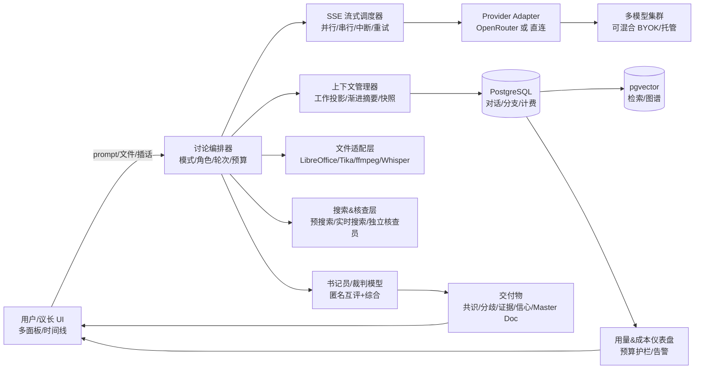
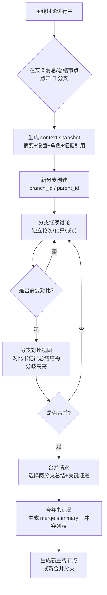

# AI 众议院（Agora）- 多模型协作讨论平台

## 项目概述文档 v2.0

> 最后更新：2026年3月11日
> 作者：Rayson（老孟）
> 项目状态：规划阶段

---

## 一、项目背景与核心问题

### 1.1 用户痛点

当前 AI 重度用户普遍订阅了多个大模型服务（ChatGPT Plus、Claude Pro、Gemini Advanced 等），讨论复杂问题时需要在多个平台之间复制粘贴，效率极低。用户真正需要的不是"并排对比答案"，而是**让多个模型围绕同一个话题展开真正的讨论和辩论**，在互相碰撞中产出更高质量的思考。

### 1.2 产品愿景

**日常是你的主力 AI 客户端，重要时刻是你的 AI 众议院。**

大多数用户 80% 的时间只需要一个模型快速回答问题。但剩下 20% 的高风险决策（投资、技术选型、法律评估、方案评审），单模型的回答不够可靠。Agora 的核心定位是：**一个产品覆盖全部需求**——日常用单模型快问（取代分别订阅 ChatGPT/Claude/Gemini），重要问题一键召集多模型议会展开辩论。

这不是两个产品拼在一起，而是同一个产品的两种状态：单模型对话就是"议会里只有一位议员在发言"，随时可以升级为多模型讨论。用户不再需要在 3 个 AI 产品之间切换，Agora 一个入口解决所有问题。

### 1.3 核心差异化（对比当前竞品）

市面上的工具存在三极分化：
- **日常聊天派**（ChatGPT/Claude/Gemini）：日常好用但只有一个模型视角，重要决策容易"一家之言"
- **并排对比派**（ChatHub/ChatALL/Poe）：能看到多个模型的回答，但模型之间不互动，用户自己做综合
- **多模型协作派**（Multiple.chat/Quorum AI/Perplexity Model Council）：模型间有互动，但**只能做议会讨论不能日常聊天**——用户 80% 的时间还是得回到 ChatGPT

Agora 是唯一同时覆盖"日常快问"和"议会辩论"的产品。核心差异点：

- **"一个入口取代三个订阅"**：日常用单模型快问（通过 OpenRouter 访问所有模型），重要问题一键升级为议会讨论。用户省钱（$20/月 vs 分别订阅 $60/月），还能用到更多模型
- **白盒对抗与分歧分类**：把"分歧"作为核心功能——共识代表高信心，分歧代表该深挖的地方。自动分类为🔴事实冲突、🟡语境缺失、🔵逻辑分歧
- **匿名同行评审**：模型在互评时隐藏身份，打破品牌偏见
- **意图感知式实时打断**：用户打断时，系统自动识别意图类型动态调整讨论——竞品普遍缺失的旗舰功能
- **决策级交付**：一键生成专业文档（10+ 种格式），附完整审计追踪
- **跨会话决策图谱记忆**：历史审议自动注入新讨论上下文，让平台越用越懂用户
- **讨论成果可沉淀、可分享、可分叉**，形成知识积累

---

## 二、全景竞品分析

在 2025-2026 年间，多模型协作已成为 AI 赛道的热门方向。我们深度解构了 14+ 个竞品，制定了超越策略。

### 2.0 行业共同收敛点

竞品在以下四点已经达成事实性共识，Agora 不必重新发明轮子，直接站在这些肩膀上：

1. **统一交付物优先于全量对话**：Perplexity Model Council 与 AI Council 都强调"综合答案+一致/分歧提示+置信度"，把多轮互审放在幕后，降低用户阅读负担
2. **匿名化互审逐渐成为标配**：LLM Council 与 AI Council 都明确将评审阶段匿名化，减少"偏好某模型/品牌"的系统性偏差
3. **"模式化协作"比"并排对比"更能收费**：MultipleChat 把协作拆成多种模式与可配置 Roles/Guards，直接成为产品主价值
4. **单位经济是顶层约束**：媒体反复提到，多模型在"订阅平价"下的 unit economics 并不透明；因此竞品普遍采用高价分层、credits、或 BYOK 混合

### 2.1 头部竞品拆解

| 竞品 | 竞品做法 | 竞品局限 | Agora 的优势 |
|------|---------|---------|------------|
| **Quorum AI** | 7 种正式审议方法（牛津辩论/德尔菲/苏格拉底等），结构化批评带"同意/不同意/缺失"标记，信心评分 | 近零公开曝光度，品牌与 5 个同名产品混淆，首页 demo 疑为脚本化 | Agora 提供完整的人类决策框架适配（德尔菲、牛津、苏格拉底等），且 UI 更现代、品牌更清晰 |
| **Multiple.chat** | "分歧引擎"将模型间矛盾提取并分类；Smart 模式按复杂度自动调整协作深度；溯源透明模型（Trustpilot 3.3/5） | 多用户报告"协作是假的——答案与单模型无异"；拒绝退款导致 SCAM 指控；从不回复差评 | Agora 的分歧矩阵更进一步做到分类标注（事实/逻辑/语境/偏好），且通过匿名互评确保每轮有实质差异 |
| **Perplexity Model Council** | 三模型并行+"主席"综合；结构化输出标注一致/分歧/独特贡献；集成联网搜索+引用 | $200/月价格引发强烈反弹；过程黑盒化用户无法干预；固定 3 模型无法自定义 | 提供从"自动收敛"到"深度展开"的滑块，让用户随时展开看思考链并干预；$20 起步 |
| **Poe** | @mention 范式立刻可理解（类 Slack）；跨 bot 切换保留完整上下文；跨平台（iOS/Android/Web） | 纯手动编排，模型不主动互相批判只是各说各话；积分消耗焦虑（Claude Opus 12K 点 vs GPT-4 350 点） | 采用自动化模式编排（系统分配正反方和评审），无需用户手动推进；积分+BYOK 混合消除焦虑 |
| **Karpathy LLM Council** | 开源黄金法则：独立意见→匿名互评→主席综合；证实匿名化可打破品牌偏见 | 仅为代码脚本无前端；固定三步走不支持连续对话；发现模型一致偏袒 GPT-5.1 | 将"匿名互评"作为 Agora 第二轮默认机制；加入反谄媚指令和品牌信息剥离 |
| **DebateAI.app** | 动量分析+转折点检测；4 轴评分（说服力/逻辑/证据/修辞）；链式辩论（Investigations）逐层深入 | iOS 免费版完全不能用（致命首次体验）；UI"粗糙半成品"；3 次/月免费太少 | Agora 的辩论模式内置动量分析、多轴评分和自动终止，且免费版首次体验零障碍 |
| **AISCouncil** | 7 种模式+模式链式组合；零服务器隐私架构；BYOK + 300+ 模型（OpenRouter）；按地区定价 $3-9 | 当前显示"维护中"；零用户评论；浏览器存储=清数据则丢失 | Agora 同样具备智能路由和民主投票模式，且架构更稳定、数据可持久化 |
| **Big-AGI Beam** | 清单引导合并（PCA 启发分解回答为正交成分让用户勾选）；~35% 用户每日使用；"共识=信心，分歧=调查" | 需多家 API Key 设置复杂；融合质量取决于执行模型；无自动"最佳模型"选择 | Agora 的引导融合让用户主动选择哪些维度进入最终结论，且支持 BYOK 降低使用门槛 |
| **Roundtable AI** | @mention 系统+Secretary Agent 生成决策摘要；Decision Trails 分支对话+审计轨迹 | $30-100/月全行业最高且零评论；仅 4 家提供商；无免费层 | Agora 的书记员+审计追踪功能更完整，且 $20 起步+慷慨免费层，价格仅为其 1/3 |
| **Botgroup.chat** | 微信风格群聊隐喻极其直观；小红书爆火 18K+ 赞，10K DAU；获厂商 11.5 亿 token 赞助 | 顺序回答（排队）降低真实感；无智能插嘴逻辑所有 AI 回复一切；token 成本爆炸 | Agora 的圆桌模式同样采用群聊隐喻 UI，但增加了选择性发言（模型根据相关性决定是否插嘴）和成本控制 |
| **FlagEval Debate** | 5 轮辩论+换边消除位置偏差；专业辩论冠军评委 | 仅 2 模型配对辩论；完全依赖人工评估；学术评测平台非消费产品 | Agora 的辩论模式支持换边机制，且面向消费级产品而非学术评测 |
| **AI 圆桌 Chrome 扩展** | `/mutual` 对称互评 + `/cross` 定向评价；不需要 API 直接用已有订阅 | DOM 依赖=平台 UI 一更新就挂；仅 93 用户 | Agora 的 @mention 和渐进深度工作流基于 API 实现，稳定性远超 DOM 操控 |
| **ai-counsel (MCP)** | 决策图谱记忆+自动注入历史先例；自动收敛检测（≥85% 相似度停止）；193 Star 活跃开发 | 仅为 MCP 服务器无独立 UI | Agora 将决策图谱记忆产品化为完整的知识图谱 UI，而非仅作为 MCP 服务 |
| **csv610/AIDebator** | 动态评分（+0.15 承认对方有效论点，-0.10 被识别弱点）；证据质量权重 40%；自动终止 | 仅为学术工具无消费产品体验 | Agora 将动态评分和自动终止产品化为辩论模式的内置功能，无需编程即可使用 |
| **AI Council (Techniciti)** | 三阶段审议（并行收集→匿名互审→主席综合）+ 置信度分析；**隐私核心**：零后端存储、设备端 AES-256 加密、Keychain、直连 API；支持本地模型与 BYOK | 移动端原生体验强但 Web 分享/社区扩散弱；插话/打断/分叉/知识图谱不突出 | Agora 同样具备三阶段审议+置信度分析和 BYOK 直连，但增加了实时插话、分叉、知识图谱等 AI Council 缺少的关键功能 |
| **AI-CrossTalk** | 在 ai-roundtable 上补齐国产模型与 Web 控制面板；"引用其它 AI 回答"与互评/交叉更工程化；支持刷新对话/后台打开 | 同属网页端自动化路线，稳定性和维护成本高 | 覆盖国产模型矩阵与"刷新/重新采集"容错交互；DOM 操控仅做可选扩展 |
| **llm-debate-arena** | 把辩论做成可观赛的对战系统：ELO 排名、多裁判投票、SSE 流式、历史沉淀 | 更偏评测/竞技，离"用户决策"有距离 | 整合"辩论广场/排行榜"作为传播增长模块（与主线产品解耦避免娱乐化）；多裁判投票机制用作收敛判定的可选器 |
| **AiZolo** | $9.9/月多模型聚合工作区，明确宣传"Seamless model switching without losing context"，支持跨厂商（ChatGPT/Claude/Gemini/Perplexity/Grok），有并排对比、项目管理、AI Memory | 纯聚合器——模型之间不互动、无互评、无辩论、无书记员总结、无分歧分析。解决的是"不用开多个窗口"，不是"让模型互相挑战" | Agora 的单模型快问体验对标 AiZolo（可变模型+上下文保留），但 Agora 独有的议会辩论是 AiZolo 完全没有的维度。$9.9 定价对我们 $20 Pro 有压力——需要用议会功能证明溢价合理性 |
| **AiZolo** | $9.9/月多模型聚合工作区；支持对话中切换模型不丢上下文（跨厂商）；并排对比；项目管理+AI Memory；BYOK 支持；SEO 内容矩阵铺得很猛 | 只做"聚合+切换+对比"，模型之间不互动不辩论；无匿名互评/书记员/分歧矩阵；$9.9 定价对我们 $20 Pro 有压力 | Agora 的单模型快问与 AiZolo 直接竞争，但议会讨论（匿名互评+分歧矩阵+书记员）是 AiZolo 完全没有的维度。我们是"AiZolo 的日常体验 + 全行业独有的议会辩论" |

### 2.2 全行业 10 大用户痛点（我们必须解决的）

1. **"协作"往往是表演**——宣传的多模型互动产出与单模型无异（Multiple.chat 差评核心原因）
2. **订阅疲劳**——用户已花 $80-200+/月在 AI 上，又要加一个账单
3. **API 路由让一切变慢**——等最慢的模型毁掉体验
4. **信息过载**——3-5 个同时回复无引导地造成认知负担
5. **模型趋同为群体思维**——谄媚级联导致弱模型将强模型带偏
6. **学习曲线陡**——最需要多模型对比的决策者最不能忍受 API Key 设置
7. **模型间无持久记忆**——切换模型丢失上下文
8. **联网/研究集成不靠谱**——承诺的实时核实很少真正工作
9. **无专业交付物**——聊天记录不是决策文档
10. **地区限制**——API 依赖型平台继承提供商地域限制

### 2.3 全行业 10 大未满足需求（我们的机会）

1. **自动综合/合并**多模型回答为单一可执行答案（#1 缺口）
2. **智能自动路由**按任务选最佳模型（AISCouncil 的 Smart Router 方向正确）
3. **信心/一致评分**+高亮分歧点
4. **跨模型幻觉检测**通过自动事实交叉引用
5. **可保存/可重放的工作流模板**
6. **可视化论点/决策地图**
7. **团队协作**多模型讨论+标注
8. **可配置对抗程度**——控制模型挑战彼此的激烈程度
9. **决策级专业文档输出**
10. **跨会话记忆和知识积累**

### 2.4 UX 效果分级（指导我们的设计优先级）

**S 级（验证有效，必须做）**：
- 议会/共识+阶段制：独立→互评→综合（Karpathy 金标准架构）
- 引导融合+用户控制（Big-AGI 清单合并）
- 结构化分歧展示（Perplexity 一致/分歧表）

**A 级（特定场景有效，第一版做）**：
- @mention 多 bot 聊天（Poe/Roundtable 范式）
- 正式辩论格式（牛津/苏格拉底/德尔菲）

**B 级（常见但有限，后续迭代）**：
- 并排并行展示（3+ 模型时认知过载）
- 标签页切换（用户容易错过差异）

### 2.4.1 竞品功能覆盖矩阵

以下矩阵展示各竞品在关键维度的实现情况，**空白处即 Agora 的差异化切入点**：

| 维度 | Perplexity MC | MultipleChat | AI Council | AiZolo | Poe | Agora 定位 |
|------|:---:|:---:|:---:|:---:|:---:|:---:|
| 跨厂商切换不丢上下文 | ❌ | ❌ | ❌ | **✅** | ⚠️新会话 | **✅ + 可升级议会** |
| 多模型议会/辩论 | ⚠️黑盒 | ⚠️假协作 | ✅三阶段 | ❌ | ❌ | **✅ 匿名互评+分歧矩阵** |
| 匿名互审 | ❌ | ❌ | ✅ | ❌ | ❌ | ✅ 默认开启 |
| 分歧分类标注 | ⚠️ | ⚠️ | ❌ | ❌ | ❌ | **✅ 四类标签** |
| 书记员结构化总结 | ⚠️综合 | ⚠️ | ✅主席 | ❌ | ❌ | **✅ 三方检查** |
| 用户插话/打断 | ❌ | ❌ | ❌ | ❌ | ✅ | **✅ 意图感知** |
| 分叉/分支对比 | ❌ | ⚠️情景 | ❌ | ❌ | ❌ | **✅ Git 式** |
| 专业交付物生成 | ❌ | ❌ | ⚠️模板 | ❌ | ❌ | **✅ Master Doc** |
| BYOK + 积分混合 | ❌ | ⚠️订阅 | ✅ | ✅BYOK | ❌ | ✅ 混合制 |
| 价格 | $200/月 | $8.99/月 | 免费+BYOK | $9.9/月 | $19.99/月 | $20/月（含议会） |

**Agora 的核心定位**：AiZolo 证明了"多模型聚合+切换"有市场。但他们只做到"让你方便地用多个模型"，没做到"让模型互相挑战得出更可靠的结论"。Agora = AiZolo 的日常体验 + 全行业独有的议会辩论。

### 2.5 市场验证信号

- Perplexity 于2026年2月推出 Model Council，直接验证多模型协作概念（公司估值90亿美元+）
- Andrej Karpathy 发布开源 LLM Council，行业顶级 KOL 背书，催生 20+ 衍生项目
- 学术界25+篇论文证明多智能体辩论可提升推理准确性（MIT CSAIL 等）
- 全球已有 12+ 商业产品和 20+ 开源项目涉足此领域，但**零大额融资创业公司**——市场空白清晰
- Botgroup.chat 小红书爆火（18K+ 赞）证明中文市场需求真实存在

### 2.6 目标用户规模

全球约 200-500万潜在用户。推算依据：

- ~2000万 ChatGPT 付费用户
- 其中 ~15% 同时使用 Claude
- ~30% 付费用户订阅了 2+ AI 服务
- 按技术门槛/付费意愿过滤

### 2.7 窗口期判断

**窗口期正在收窄。** Perplexity 已入场，Quorum AI 和 Multiple.chat 在快速迭代，Karpathy 的 LLM Council 催生了大量开源衍生品。但目前全行业处于"前机构化"阶段——没有任何获得大额融资的公司专注此方向，没有 YC 公司，没有财富 500 强产品。先发优势的关键窗口期约为 6-12 个月。

---

## 三、产品设计

> 产品外壳与视觉体验的完整定义（Landing Page、视觉风格、桌面/移动端布局、动效、分享卡片、种子内容策略）详见第十三章 13.0 节的 MVP 产品交付详案。以下章节聚焦功能设计。

### 3.1 产品双态设计与讨论模式

#### 3.1.0 双态架构：日常对话 ↔ 议会讨论

Agora 的界面有两种状态，共享同一个输入框和数据模型：

**默认态：可变模型对话（高频日常）——"模型可变的单模型聊天"**

用户打开 Agora，看到的是一个简洁的 AI 聊天界面——跟 ChatGPT 的体验一样熟悉。但有一个关键区别：**"可变模型对话"——对话中随时切换模型，不丢上下文**。

- 通过 OpenRouter 可以访问所有主流模型（Claude/GPT/Gemini/DeepSeek/Grok/Qwen 等），一个平台取代多个订阅
- **对话中随时切换模型**——先和 Claude 聊三轮，换成 GPT 继续聊，再换 Gemini，再换回 Claude。对话历史完整保留，切换后的模型能看到之前所有轮次。每条消息显示来自哪个模型（头像+品牌色）
- 在同一对话中 @另一个模型获取第二意见（"@Gemini 你怎么看？"）
- 成本极低：单次快问约 $0.001-0.01

**这不是简单的"多模型聚合"**。ChatGPT 的 @model 切换只限 OpenAI 自家模型（GPT-4o/o1/mini）。AiZolo 做了跨厂商切换但模型不互动。TypingMind/ChatHub 切换模型开新对话。**Agora 是唯一同时做到"跨厂商切换不丢上下文"+"一键升级为多模型议会辩论"的产品。**

**升级态：议会讨论（低频高价值）**

当用户遇到需要深度思考的问题，输入框旁边有一个显眼的按钮：**"召集议会 🏛️"**。点击后选择讨论模式、参与模型，开始多模型辩论。

- 系统智能提示：检测到用户问题是高风险决策类（包含"应该选A还是B"、"评估一下"、"有什么风险"等），自动浮出"这个问题要不要召集议会讨论？"
- 对话中随时可升级：聊着聊着觉得需要多角度，一键把当前对话上下文带入议会讨论
- 议会讨论结束后自动回到对话状态，追问阶段就是单模型对话

**为什么这样设计**：

技术上，单模型对话就是"只有 1 个模型参与的讨论"——编排引擎完全复用，只是参与者数量从 1 变成 N。不需要两套系统。

商业上，这解决了致命的留存问题——如果 Agora 只有议会模式，用户每周只打开 1-2 次（80% 日常需求还是去 ChatGPT），打开频率低则留存差。加了日常快问后，用户每天都在 Agora 里，高频使用自然导流到议会讨论。$20 Pro 档积分池的利用率从 6% 提升到 20-35%，用户觉得值。

竞争上，这是对所有竞品的降维打击：对 ChatGPT/Claude 说"别分别订阅了，$20 用所有模型"；对 Multiple.chat/Quorum AI 说"他们只能多模型讨论，你日常还得用 ChatGPT，我们一个产品全搞定"。

#### 3.1.1 议会讨论模式（5 种）

产品提供五种议会讨论模式，适用于不同场景：

##### 共识模式（Consensus / Fusion）

- **适用场景**：日常快速决策，"帮我做选择"，发散性头脑风暴
- **流程**：各自独立回答 → 互相查看后修正 → 书记员提取共同点和差异点 → 综合结论
- **目标**：求同，三轮基本收敛
- **结束方式**：自动收敛（自动收敛检测：≥85% 相似度自动停止），书记员提取共同结论
- **预设角色**：不强制分配，模型自由发言
- **引导融合**：书记员综合时，将多个回答分解为正交维度（成本、可行性、创新性、风险等），用户可勾选哪些维度进入最终结论

#### 3.1.2 辩论模式（Competitive Debate）

- **适用场景**：投资决策、技术选型等需要充分考虑风险的场景
- **流程**：分配正反方（如 GPT 挺正方，Claude 挺反方） → 各自寻找论据并反驳对方 → **匿名同行评审**（各模型盲评对方论点质量，详见 3.2.1） → 法官模型（廉价快模型）输出裁决
- **目标**：不追求统一，充分暴露正反论点
- **结束方式**：固定轮次后输出"正方最强论点 vs 反方最强论点 + 裁判评判"
- **预设角色**：正方、反方、裁判、事实核查者
- **增强机制**：
  - **换边机制**（可选开启）：辩论结束后，正反方交换立场再辩一轮，消除位置偏差（可选开启）
  - **动量分析**：追踪论点强度时间线，识别辩论走向的关键转折点
  - **动态评分**：+0.15 奖励承认对方有效论点，-0.10 惩罚被识别弱点，证据质量权重 40%

#### 3.1.3 红队模式（Red Team）

- **适用场景**：检验方案/想法的健壮性（如融资pitch评审、PRD评审、系统架构审查）
- **流程**：用户提交方案 → 多个模型化身不同维度的"攻击者"（财务视角、安全视角、合规视角、体验视角）同时找漏洞
- **目标**：找出方案中所有漏洞和风险
- **结束方式**：生成《漏洞与风险排除清单》
- **预设角色**：提案者 × 1 + 挑战者 × N（按维度分工）

#### 3.1.4 圆桌模式（Roundtable）

- **适用场景**：开放性探讨、头脑风暴
- **流程**：各模型平等发言、自由互动，用户主持引导
- **目标**：发散思考，探索多种可能性
- **结束方式**：用户手动结束 + 书记员整理要点
- **预设角色**：实用主义者、理想主义者、怀疑论者、综合者
- 采用群聊隐喻 UI，模型根据话题相关性**选择性发言**（而非每个模型必须对每条消息回复），减少信息过载

#### 3.1.5 顺序接力模式（Sequential Build）

- **适用场景**：内容创作、方案迭代、报告撰写等需要逐步打磨的场景
- **流程**：模型 A 起草初稿 → 模型 B 作为专家纠正和深化 → 模型 C 补充缺失视角 → 模型 D 做最终审校
- **目标**：逐层优化，每一步都在前一步基础上增量改进
- **结束方式**：最终版本 + 各阶段修改追踪（diff 视图）
- **预设角色**：起草者 → 批评者 → 补充者 → 审校者
- **设计理念**：将内容创作从一次性生成变成多模型接力打磨的迭代过程

### 3.2 角色系统

每个模型在讨论中扮演特定角色，角色分两个层面：

**能力角色**（利用模型天然差异）：
- Claude：深度分析、细腻表达、安全审慎、联网搜索（API 支持）
- GPT：广度覆盖、结构化、创意、联网搜索 + 代码执行（API 支持）
- Gemini：实时 Google 搜索（Grounding）、多模态（视频/音频）、数据分析
- DeepSeek：中文优势、技术推理、性价比极高、完整思考链（R1）
- Grok：直接、少过滤、对抗性强、实时 X/Twitter 数据接入
- Perplexity（特殊角色）：不参与辩论发言，作为"事实核查员"在每轮后对全场事实性声明做搜索验证（Pro Max 及以上专属）

**立场角色**（通过 system prompt 强制分配）：
- 实用主义者：关注可行性和成本
- 理想主义者：关注长期价值和创新
- 怀疑论者：专门挑毛病、找漏洞
- 综合者：寻找各方交集、弥合分歧
- 挑战者：直接质疑、不留情面（Grok 特有）

**默认角色-模型匹配**（系统自动分配，用户可选调整）：

| 模式 | Claude | GPT | Gemini | DeepSeek | Grok |
|------|--------|-----|--------|----------|------|
| 共识模式 | 怀疑论者 | 实用主义者 | 综合者 | 理想主义者 | 挑战者 |
| 辩论模式 | 反方 | 正方 | 裁判 | 正方 | 反方 |
| 红队模式 | 主挑战者 | 挑战者 | 事实核查 | 提案者 | 挑战者 |
| 圆桌模式 | 风险视角 | 商业视角 | 数据视角 | 技术视角 | 用户视角 |

匹配逻辑：Claude 天然偏保守所以让它挑刺效果好，GPT 偏乐观所以做 advocate 效果好，Gemini 有搜索能力适合做事实基础角色，DeepSeek 推理强适合深度技术分析，Grok 少过滤适合做直接挑战。

**角色自定义（高级功能）**：
- **简单模式（默认）**：用户只选讨论模式，系统自动分配。界面显示一行小字标注分配结果
- **高级模式（折叠展开）**：可拖拽调整模型-角色匹配，或自定义角色描述（如"苛刻的 VC 合伙人"）
- **模板保存**：自定义角色组合可保存为模板，分享到模板市场
- **Roles & Guards**：角色系统分两层实现——(1) "立场角色"用 system prompt 硬约束；(2) "流程角色"用调度器约束（Creator/Reviewer/Verifier/Humanizer），可做成可视化 pipeline。另外提供"护栏规则"配置：如"必须引用数据源"、"禁止人身攻击"、"回答长度限制"等

#### 3.2.2 模型数量

**海外默认 5 个模型**：Claude + GPT + Gemini + DeepSeek + Grok

**数量限制与分层**：

| 用户等级 | 最大模型数 |
|---------|-----------|
| Free | 3 |
| Pro | 5 |
| Pro Max / Ultra | 10 |
| BYOK Standard | 5 |
| BYOK Premium | 10 |

**超过 5 个模型的提示**：

超过 5 个时弹出提示："预估单次讨论消耗约 $0.25（默认 5 模型的 1.8 倍）。更多模型 = 更多视角，但也可能导致讨论发散。"

超过 8 个时升级为警告："这是专家模式。9 个模型同时讨论信息量极大，建议配合辩论模式分组对抗使用。"

**超过 4 个模型时的辩论分组**：

- 5 个模型：正方 ×2 vs 反方 ×2 + 裁判 ×1
- 6 个模型：正方 ×2、反方 ×2、裁判 ×1、事实核查 ×1
- 7-8 个模型："议会制"——分成 2-3 个"党派"，先党内统一再跨党辩论

**设计原则**：
- 角色由系统根据讨论模式**自动分配**，用户无需手动配置
- 高级用户可在设置中调整角色分配
- 反谄媚指令：每个模型必须找出至少一个不同意的点
- 第二轮采用匿名互评（详见 3.2.3），避免"品牌偏见"

#### 3.2.3 特色编排机制

##### 匿名同行评审（Anonymized Peer Review）

在多轮辩论中，当要求模型互相评价时，系统在后台抹除大模型的身份标识（替换为"选手 A"、"选手 B"、"选手 C"）。

**解决痛点**：Karpathy 在 LLM Council 实验中发现，模型会"一致夸奖 GPT-5.1 为最佳、选 Claude 为最差"——品牌光环导致评价严重失真。匿名化后，模型只能基于论点质量而非品牌来评价。

**实现方式**：
- 后台将每个模型的输出替换身份标签后重新注入其他模型的上下文
- 每轮随机打乱匿名编号（选手 A 在第一轮可能是 Claude，第二轮可能变成 GPT）
- 前端可选"揭晓模式"——讨论结束后展示匿名身份对应的真实模型

**应用范围**：辩论模式的互评阶段（默认开启）、共识模式的第二轮修正（可选开启）

##### AI 分歧矩阵（Disagreement Engine）

当模型意见不一致时，系统不简单地"和稀泥"，而是由书记员模型介入，将分歧**结构化分类展示**（超越竞品的简单"展示不同"，做到"分类不同"）：

- 🔴 **事实冲突**：对同一客观数据的不同认定（自动触发网络搜索核实）
- 🟡 **语境缺失**：一个模型考虑了某极端情况，另一个没有（提示用户补充信息）
- 🔵 **逻辑分歧**：事实一致，但推导出的结论不同（标注各自推理链差异点）
- ⚪ **偏好差异**：无客观对错，纯粹是不同价值取向的选择（交由用户判断）

**核心原则**（采用 哲学）：**共识 = 高信心，分歧 = 该深挖的地方。** 分歧不是 bug，是产品的核心价值。

**视觉呈现**：书记员总结中，每个分歧点以卡片形式展示，显示持不同意见的模型、各自理由摘要、分歧分类标签、以及"深入探讨此分歧"按钮（一键触发针对该分歧点的新一轮讨论）。

##### 自动收敛检测与动态评分

**收敛检测**（引入）：每轮结束后，系统计算各模型立场的语义相似度：
- ≥85% → "已收敛"，建议结束，节省 API 成本
- 40-85% → "趋向收敛"，继续讨论有价值
- <40% → "分歧显著"，提示用户可能需要补充信息或转换讨论模式

**动态评分**（引入，辩论模式专属）：
- +0.15 分：承认对方有效论点（奖励智力诚实）
- -0.10 分：被识别的逻辑弱点
- 证据质量权重占总分 40%
- 论点缺乏新意时自动提示"辩论趋于重复，建议进入总结阶段"

### 3.2.4 Prompt Engineering 策略（核心竞争力）

这是整个产品能否成功的**重中之重**。所有竞品的最大失败原因就是"假协作"——模型互相客套而非真正辩论。Prompt 质量直接决定讨论质量。

#### 反谄媚 Prompt 设计

**核心问题**：所有大模型默认倾向"和稀泥"——Claude 会说"你说得有道理，但我补充一下"，GPT 会说"这是一个很好的观点"。必须通过精心设计的 system prompt 打破这种默认行为。

**反谄媚指令模板（基础版）**：
```
你是一位 [角色名称]，在一场多模型讨论中负责 [角色职责]。

核心规则：
1. 你必须找出其他参与者观点中至少一个你不同意的地方，并明确指出
2. 禁止使用以下开头：你说得对/你的观点很好/我同意...不过/这是一个很好的问题
3. 如果你真的完全同意某个观点，必须说明为什么同意，并提出一个该观点没有考虑到的边界条件
4. 直接说你的结论，不要先肯定别人再转折
5. 用证据和逻辑说话，不要用礼貌代替论证
```

**辩论模式专用指令（强对抗版）**：
```
你被分配为 [正方/反方]。你的唯一目标是让你这一方获胜。

规则：
1. 绝不承认对方论点有效——找出每个论点的漏洞
2. 如果对方引用了数据，质疑数据的时效性、样本量、来源可信度
3. 如果对方做了类比，指出类比的不恰当之处
4. 每次发言必须包含至少一个对方没有考虑到的反例或边界条件
5. 你的目标不是"平衡"，是"赢"
```

**匿名互评专用指令**：
```
以下是几位匿名参与者对同一问题的回答。请从以下维度逐一评价，使用 1-10 分制：
- 论证逻辑严密度
- 证据充分性
- 实用性/可执行性
- 创新性

评价规则：
1. 你不知道这些回答来自哪个模型，不要猜测
2. 不允许给所有参与者相近的分数——必须拉开至少 3 分的差距
3. 必须指出每个回答中最弱的一个论点
```

#### 模型适配策略

不同模型的 system prompt 遵从度差异显著。这是一个需要**持续迭代和 A/B 测试**的核心资产，而非一次性配置：

| 模型 | 遵从度特征 | 适配策略 |
|------|----------|---------|
| Claude | 高遵从度但偏保守安全，容易主动添加 disclaimer | 反谄媚指令可以更简洁；需要额外指令"不要添加安全声明和免责条款" |
| GPT | 中高遵从度，偏向结构化输出 | 反谄媚指令需要更明确具体；可以利用其结构化倾向要求分点反驳 |
| Gemini | 中等遵从度，有时会忽略角色约束 | 需要在每轮重复角色提醒；反谄媚指令要放在 prompt 开头而非结尾 |
| DeepSeek | 中文遵从度高但英文场景可能偏弱 | 中文 prompt 效果更好；复杂角色指令需要更详细的示例 |
| Grok | 天然少过滤，遵从度较好 | 反谄媚指令可以最少，重点约束输出长度和格式 |

**迭代节奏**：
- MVP 阶段：先用统一 prompt 模板跑通，人工审核前 100 场讨论的质量
- 第二个月：根据审核结果，针对每个模型微调 prompt（A/B 测试不同措辞）
- 持续：建立 Prompt 质量评分体系（自动化 + 人工抽检），每两周迭代一次

**质量度量指标**：
- 对抗性评分：每轮发言中"实质性反驳"占比（目标 >60%）
- 客套指数：使用预定义客套句式的频率（目标 <10%）
- 评分区分度：匿名互评中最高分与最低分的差值（目标 >3 分）
- 用户满意度：讨论后用户对"讨论是否有实质碰撞"的评分

**自动化质量评估管线**：
每场讨论结束后，用一个评估模型（GPT-4o-mini）读取完整讨论记录，按预定义 rubric 输出打分 JSON：

```json
{
  "sycophancy_score": 0.08,
  "adversarial_score": 0.72,
  "unique_arguments": 12,
  "position_changes": 2,
  "evidence_citations": 8
}
```

成本约 $0.002/场，需计入总运营成本。没有这个管线，prompt 调优就是盲人摸象——每次改 prompt 后必须能看到指标变化。数据汇入管理后台"讨论质量趋势面板"。

**输出长度控制**：
不同模型默认输出长度差异巨大（Claude 800 字 vs Grok 200 字），会导致讨论"偏科"——长回答天然占据用户注意力。Prompt 中统一添加长度约束：
- 第 1 轮独立回答：200-400 字
- 第 2 轮互评：150-300 字（聚焦分歧点，不重复论述）
- 第 3 轮反驳：150-300 字
- 具体数值按模型微调（DeepSeek 中文场景容易超长，需更强约束）

**多样性感知初始化（Diversity-aware Initialization）**：

当前设计中，第一轮所有模型面对完全相同的用户输入和背景上下文独立回答。这在起点上就扼杀了生成空间的多样性——4 个模型的初始回答极易高度同质化，后续"辩论"沦为形式主义。学术研究（多智能体辩论的鞅过程限制）证明：如果初始解空间太窄，后续轮次的信念交换无法系统性提升正确率。

**解决方案（Phase 2 迭代，MVP 先用统一 prompt）**：
- 为不同模型注入略微不同的初始视角约束（如"请优先从成本角度分析" vs "请优先从技术可行性角度分析"），扩大第一轮回答的多样性
- 配合不同的 temperature 参数（第一轮 0.8-1.0，后续轮次降到 0.3-0.5）
- 效果指标：第一轮 4 个回答的语义相似度应 < 0.7（用 embedding 计算），如果 > 0.85 说明多样性不足

### 3.3 API 高级功能支持与搜索增强

#### 3.3.1 各模型 API 功能矩阵

| 功能 | OpenAI API | Claude API | Gemini API | DeepSeek API | Grok API |
|------|-----------|------------|------------|-------------|---------|
| 联网搜索 | ✅ web_search 带引用 | ✅ web_search 带引用 | ✅ Google Search Grounding 带结构化引用 | ❌ 不支持 | ✅ live search |
| 思考/推理模式 | ✅ o3/o4 reasoning tokens | ✅ extended thinking | ✅ thinking mode | ✅ R1 完整思考链 | ✅ thinking mode |
| 深度研究 | ✅ o3-deep-research（异步，5-30分钟，$1-10/次） | ❌ API 不支持 | ⚠️ 有但不成熟 | ❌ | ⚠️ DeepSearch 有限 |
| 文件上传 | ✅ 图片/PDF/代码 | ✅ 图片/PDF/代码 | ✅ 图片/PDF/视频/音频 | ⚠️ 图片，PDF 有限 | ✅ 图片 |
| 代码执行 | ✅ code_interpreter | ❌ | ✅ code_execution | ❌ | ❌ |
| 引用来源 | ✅ inline citations | ✅ 引用索引 | ✅ groundingMetadata 完整引用链 | ❌ | ⚠️ 有但结构化较低 |

#### 3.3.2 搜索增强与事实核查设计（v2.0 三层架构）

讨论设置中提供搜索增强选项（v2.0 升级为三层分层策略，采用 Web-Aided + Auto Verification 机制）：

**第一层：智能预搜索（共享上下文）**
- 讨论前用 Gemini 做一次预搜索（Google Search Grounding 免费额度 1,500次/天），搜索结果作为共享上下文喂给所有模型。成本约 $0.01
- 适用场景：大多数讨论的默认模式

**第二层：模型内实时搜索（Web-Aided）**
- 在需要时效性数据时，让支持搜索的模型中途搜索并带引用
- 引用更丰富但成本更高

**第三层：独立核查员（Auto Verification + Smart-Skip）**
- 采用 Auto Verification 机制，用一个固定核查模型（如 GPT-4o-mini）做三步审稿：
  1. **Smart-Skip 判定**：先判断回答是否需要核查（纯观点/创意内容自动跳过，事实性声明进入核查）。跳过原因**显式展示**给用户（如"该段为主观建议，已跳过核查"）
  2. **正确性验证**：对需核查内容进行搜索核实
  3. **问题标注**：输出"正确 ✅ / 存疑 ⚠️ / 冲突 ❌ + 引用来源"

**界面设计**：
- 关闭 / 智能预搜索（默认）/ 实时搜索+核查 三档开关
- 模型发言引用了搜索结果标注 🌐 + 来源链接；纯训练数据回答标注 📚
- 核查结果以行内徽章展示，可展开查看核查详情
- **核查 smart-skip 命中率目标**：≥30% 的回答无需核查即可跳过（节省 API 成本）

#### 3.3.3 思考链展示

支持思考模式的模型（o3、R1、Claude extended thinking、Gemini thinking），在每条发言下方提供可折叠的"展开思考过程"区域。用户不仅看到结论，还能看到模型的推理链路。

#### 3.3.4 文件格式支持矩阵

各模型 API 对常见文件格式的原生支持差异极大：

| 文件类型 | OpenAI API | Claude API | Gemini API | DeepSeek API | Grok API |
|---------|-----------|------------|------------|-------------|---------|
| PDF | ✅ 原生 | ✅ <100页图文并读 >100页纯文本 | ✅ 原生 | ❌ | ⚠️ 有限 |
| 图片 (JPG/PNG/WebP) | ✅ vision | ✅ vision | ✅ vision | ✅ vision | ✅ vision |
| DOCX | ✅ Responses API 新增 | ⚠️ 需转纯文本 | ⚠️ 需预处理 | ❌ | ❌ |
| PPTX | ✅ Responses API 新增 | ❌ 需转PDF | ⚠️ 需预处理 | ❌ | ❌ |
| XLSX/CSV | ✅ 解析前1000行 | ⚠️ 需代码执行或转文本 | ⚠️ 付费API支持 | ❌ | ❌ |
| 视频 (MP4等) | ❌ | ❌ | ✅ 最长1小时 原生 | ❌ | ❌ |
| 音频 (MP3/WAV等) | ⚠️ Whisper转文本 | ❌ | ✅ 最长3小时 原生 | ❌ | ❌ |
| 单文件上限 | 512MB | 32MB(API) | 100MB(2GB视频) | N/A | 48MB |

**核心问题：没有任何一种非图片格式是所有模型都原生支持的。**

#### 3.3.5 统一文件预处理层

产品需要一个服务端文件适配层，用户上传一次，系统自动为每个模型生成最优格式：

```
用户上传文件
      ↓
  文件适配层（服务端）
      ↓
  PDF   → 直接给 OpenAI/Claude/Gemini → 提取文本给 DeepSeek/Grok
  DOCX  → 直接给 OpenAI → 转PDF给 Claude/Gemini → 提取文本给 DeepSeek/Grok
  PPTX  → 直接给 OpenAI → 转PDF给 Claude → 逐页截图给 Gemini → 提取文本给 DeepSeek/Grok
  XLSX  → 直接给 OpenAI → 转CSV/JSON文本给其他全部
  视频  → 只给 Gemini 原生处理 → 其他模型：Whisper转写字幕 + ffmpeg提取关键帧
  音频  → 给 Gemini 原生处理 → 其他模型：Whisper转文本
```

**技术实现**：PDF转换用 LibreOffice（headless），文本提取用 Apache Tika 或 pdf2text，视频转写用 Whisper API，关键帧提取用 ffmpeg。全部成熟工具。

**信息损失追踪**：把"信息损失标注"做成产品卖点。同一文件在不同模型的"可用上下文"必须可追踪——哪页、哪段、哪张图、是否丢图表。验收标准：同一文件只上传一次，至少两个模型拿到可用内容。

**设计原则**：用户不需要知道哪个模型支持什么。上传一个 PPT，产品自动搞定。界面标注信息损失差异：

```
📄 文件分析能力差异：
  OpenAI/Claude/Gemini: 📊 完整图文分析（文字+图表+排版）
  DeepSeek/Grok: 📝 仅文本内容（图表信息可能丢失）
```

视频场景的特殊标注：
```
📹 视频分析能力：
  Gemini: 🎬 完整视频理解（画面+声音+文字）
  GPT/Claude: 🖼️ 关键帧图片 + 📝 字幕文本
  DeepSeek/Grok: 📝 仅字幕文本
```

这种透明标注反而是卖点——用户看到不同模型用不同深度的信息做出不同判断，更能理解"为什么多模型讨论有价值"。

#### 3.3.6 上传限制

| 限制项 | 值 | 说明 |
|--------|------|------|
| 单文件大小 | 50MB | 服务端压缩后再分发给各模型 |
| 单次上传文件数 | 10 个 | 太多会导致 context 爆炸 |
| 单次上传图片数 | 20 张 | 图片 token 消耗大（每张 ~1,500 token） |
| 视频时长 | Free/Pro: 5分钟, Pro Max/Ultra: 30分钟 | 视频处理成本高 |
| 音频时长 | Free/Pro: 10分钟, Pro Max/Ultra: 60分钟 | Whisper 转写按时长计费 |
| 支持格式 | PDF, DOCX, PPTX, XLSX, CSV, TXT, MD, JSON, HTML, JPG, PNG, WebP, GIF, MP3, WAV, M4A, MP4, MOV | 全覆盖 |

**超限友好提示**：不直接报错，而是说"这个 PPT 有 80 页，建议选择最关键的 20 页上传，或让我自动提取摘要后再进入讨论"。

#### 3.3.7 语音输入

**用户语音输入（Speech-to-Text）**：

| 方案 | 延迟 | 成本 | 质量 | 阶段 |
|------|------|------|------|------|
| 浏览器 Web Speech API | 实时 | 免费 | 中等 | V1 |
| OpenAI Whisper API | 1-3秒 | $0.006/分钟 | 高，多语言 | V2 |
| Deepgram Nova-2 | <300ms | $0.0043/分钟 | 高，低延迟 | V2 |

V1 用浏览器原生 Web Speech API（零成本零后端），V2 升级 Whisper/Deepgram 提升质量。

与之前讨论的"语音插话"功能衔接——用户边看讨论边说话，系统实时转文字发送。自动识别是广播还是 @ 某个模型。

**语音输出（TTS）**：四个模型同时朗读是灾难，只做**书记员总结朗读**功能。用户开车或走路时听结论。V2+ 用 OpenAI TTS API 实现。

#### 3.3.8 深度研究集成（Pro Max 及以上）

OpenAI 的 o3-deep-research 不适合放在讨论实时流程中（太慢太贵），但作为**讨论前的预备步骤**：用户先跑一次深度研究生成报告，再把报告作为讨论的输入材料。界面提供一键"基于此研究报告发起讨论"的入口。

### 3.4 发言机制与轮次控制

#### 3.4.1 发言顺序

**V1 采用同步轮次制**（推荐起步方案）：

每轮所有模型同时收到相同上下文（用户prompt + 之前所有轮次的所有发言），并行生成回复。

每轮的 prompt 结构：
```
[系统：你是"怀疑论者"角色，任务是找出其他参与者论点中的漏洞]
[用户原始问题]
[第一轮 - GPT 的发言]
[第一轮 - Claude 的发言]
[第一轮 - Gemini 的发言]
[第一轮 - DeepSeek 的发言]
现在是第二轮，请针对上述发言给出你的回应，特别是你不同意的部分。
```

优点：实现简单、并行速度快、不会死循环
缺点：互动感稍弱，更像"各自发表演讲"

**V2 增加串行接力制**：A→B→C→D 顺序发言，后面的能直接回应前面的。

**V3 增加事件驱动制（@mention）**：模型发言中提到其他模型的论点，自动触发被提及模型回复。限制：每条 @mention 只允许一层深度，每模型每场最多发言 N 次。

#### 3.4.2 讨论终止机制

- **硬性限制**（默认）：最大 3 轮，到达后强制进入总结
- **Token 预算制**：总 token 上限，快用完自动收尾
- **收敛检测**（可选）：便宜模型做裁判，判断观点是否还在实质变化
- **用户手动延长**：每轮结束后用户可选"继续深入"或"进入总结"

#### 3.4.3 防止模型互相附和

- System prompt 中明确要求"必须找出至少一个不同意的点"
- 第二轮可采用匿名互评（隐藏模型身份）
- 温度调节：初始回复 0.8-1.0 追求多样性，综合环节 0.3-0.5

### 3.5 书记员（总结机制）

#### 3.5.1 设计理念

**不设"主席"，设"书记员"**。书记员不做判断，只做归纳。原因：
- 让某个模型"裁决"会引入偏见，用户不信任
- 裁判不能是运动员——参与辩论的模型不适合做总结
- 用户才是真正的"议长"，决策权应在用户手中

#### 3.5.2 实现方案

- 使用**第五个独立模型**做书记员（不参与辩论）
- 推荐使用便宜模型（GPT-4o-mini 或 DeepSeek V3），成本 <¥0.01
- System prompt 核心：你没有自己的观点，忠实归纳各方立场，标注共识和分歧

#### 3.5.2.1 书记员三方质量检查机制

书记员总结是产品的最终交付物——如果总结漏掉核心论点、错误归纳立场、或分歧分类不准，产品价值归零。采用**三方检查 + 渐进降级**策略：

**三方角色**：
1. **书记员**（GPT-4o-mini）：生成总结和分歧矩阵
2. **审查员 A**（另一个便宜模型，如 Gemini Flash）：检查"总结中提到的每个立场归属是否与原文一致"，输出问题清单
3. **审查员 B**（第三个便宜模型，如 DeepSeek V3）：检查"是否遗漏了重要论点"和"分歧分类是否准确"

如果审查员发现问题，书记员自动修正后重新输出。三方检查总成本约 $0.005/场。

**渐进降级策略**：
- 早期（前 500 场）：用强模型（如 Claude Sonnet）做审查员，建立高质量基线
- 建立基线后：大量积累 few-shot 示例（好的总结长什么样、坏的总结犯了什么错）
- 基线稳定后：切换为廉价模型做审查员，用 few-shot 保证质量不下降
- 持续监控：如果质量指标下滑，自动回退到强模型审查

**用户快速反馈**：
- 书记员总结下方增加 **👍 / 👎** 按钮
- 👎 时弹出可选标签："漏掉了重要论点"、"搞错了某个模型的立场"、"分歧分类不对"、"太笼统没有实质内容"、"其他"
- 所有反馈数据汇入管理后台的质量面板，作为 prompt 迭代和审查模型调优的核心数据源
- 前 200 场讨论创始人亲自逐条审阅书记员总结质量

#### 3.5.3 输出格式（三层交付）

**第一层：综合结论**
```
📍 共识：所有模型都同意的点（1-3条）
⚡ 分歧：核心争议是什么，各方立场
🎯 建议：基于论证质量的方向性建议
📊 信心度：高/中/低（基于论据充分程度）
```

**第二层：分歧地图**
可视化矩阵，展示每个模型在关键论点上的立场（红/绿/黄），一眼看出分歧焦点。

**第三层：完整辩论记录**
所有模型原始发言按时间线展开，供深挖细节。

#### 3.5.4 不同模式的总结差异

- **共识模式**：提取共同结论即可
- **辩论模式**：正方最强三论点 + 反方最强三论点 + 各自薄弱环节
- **红队模式**：方案 + 全部漏洞清单
- **圆桌模式**：整理讨论要点和各方观点，不做判断

#### 3.5.5 免责声明与责任边界

产品话术强调"比单模型更可靠的审议系统"——如果用户据此做了错误决策（投资亏损、选错技术栈），存在责任风险。

**每场议会讨论的书记员总结底部固定显示**：
```
⚠️ 本讨论为 AI 模拟审议，不构成财务、法律、医疗或其他专业建议。
   所有结论仅供参考，最终决策权归用户所有。
```

**数据模型预留 `risk_level` 字段**：
- `normal`：默认，无额外限制
- `sensitive`：涉及财务/法律/医疗话题——加粗免责声明 + 书记员额外提醒"建议咨询专业人士"
- `high_risk`：后续可据此决定是否禁止公开分享、是否加强事实核查

risk_level 的判定 MVP 阶段由用户手动选择或不选（默认 normal），后续可用轻量模型自动检测。

### 3.6 用户实时互动与意图感知打断

#### 3.6.1 实时多流输出与渐进呈现

**多端布局**：
- 桌面端：可拖拽的多面板网格，每面板独立滚动，实时流式输出
- 移动端：时间线模式，所有模型输出混合在一条流中，每条消息带头像标识

**渐进呈现（核心体验设计）**：
用户在等待过程中不是干等，而是能**实时看到每个模型的流式输出**——看到每个模型表达了什么观点、对其他模型提出了什么质疑。具体实现：
- 第 1 轮各模型并行输出时：4 个面板同时流式展示，用户可以边看边思考
- 第 2 轮互评时：每个模型的评价实时流出，用户能看到"Claude 正在质疑 GPT 的数据来源..."
- 书记员总结时：最终综合结论流式展示，分歧矩阵逐步构建

**讨论进度条**：
不是简单的 loading 动画，而是结构化的进度追踪：
```
讨论进度：[████████░░░░░░░░] 第 2 轮 / 共 3 轮
├─ 第 1 轮 独立回答：✅ 4/4 模型已完成
├─ 第 2 轮 匿名互评：⏳ 2/4 模型输出中...
├─ 第 3 轮 反驳修正：⏸ 等待中
└─ 书记员总结：⏸ 等待中
```

**后台讨论模式**：
用户提交议题后可以离开页面去做别的事，讨论在后台继续进行：
- 讨论完成后推送浏览器通知（Web Push Notification）
- 移动端支持推送通知（PWA 或未来原生 App）
- 回到页面时自动展示完整结果，支持回放讨论过程
- 适用场景：复杂讨论（3 轮+书记员可能需要 60-120 秒）

#### 3.6.2 意图感知打断机制（Intent-Aware Real-time Interruption）

解决传统多智能体一旦运行人类就只能干等的痛点。这是 Agora 对比所有竞品的核心体验升级——**没有任何竞品实现了意图自动分类**。

**三步流程**：

**第一步：实时中止与注入** — 用户在模型输出过程中随时打字或语音插话。系统立即挂起（suspend）当前 SSE 流。

**第二步：意图自动分类** — 后台调用轻量级模型（GPT-5 nano 或本地 NLU 分类器）判断用户插话的意图类型。注意：云端 LLM 推理的端到端延迟（网络往返+TLS+推理）即使是最快的模型也需要 300-500ms，无法做到瞬时。MVP 阶段的策略是：前端在用户开始输入的瞬间**立即本地挂起流式渲染**（0ms），然后后端异步完成意图分类（300-500ms），用户几乎无感。如果延迟仍不可接受，Phase 2 可引入本地轻量 NLU 分类器（25-45ms）做旁路检测：

| 意图类型 | 用户示例 | 系统行为 |
|---------|---------|---------|
| 🤝 合作补充（Assistance） | "预算只有50万" | 模型保留已生成内容，在下一段无缝融合新条件继续 |
| ❓ 寻求澄清（Clarification） | "等一下，解释一下这个名词" | 暂停主线，由专家模型快速解答后恢复主线 |
| 🔄 方向纠偏（Disruption） | "别聊技术了，谈商业" | 抛弃未生成的草稿，全局转向新方向 |
| 🎯 定向追问（Targeted） | "@Claude，你这个不对" | 只触发被 @ 模型回应，对话同步给其他模型 |

**第三步：视觉反馈** — 被用户打断的半截句子保留并标灰，旁边显示 🛑 由用户引导转向，保障上下文的视觉连贯性。

**防滥用机制**：
- 插话冷却时间（5秒）
- 默认"本轮结束后发送"，紧急打断需手动切换
- 每次打断浪费已生成的 output token，产品需提示用户

#### 3.6.3 降低操作成本

- **快捷反应按钮**：每个模型输出旁放"说得好"、"不同意"、"展开说"、"换角度"
- **语音插话**：用 Whisper 实时转写，自动识别是对谁说的
- **拖拽引用**：拖拽模型某句话到输入框，自动变成引用格式
- **用户标记加权**：讨论中用户标记的观点在最终总结时给予更高权重
- **对抗程度滑块**：从"温和建议"到"激烈对抗"5 档调节，控制模型挑战彼此的激烈程度

### 3.7 输入支持

#### 3.7.1 多模态输入

详见 3.3.4-3.3.7 节的完整文件格式支持矩阵、预处理层设计、上传限制和语音输入方案。

核心原则：用户上传任何格式，产品自动为每个模型转换为最优格式。用户无需关心兼容性。

#### 3.7.2 连续讨论

- 讨论之间可带记忆（上一场结论精炼为下一场背景）
- 持久化 context 管理

### 3.8 讨论后的价值沉淀

#### 3.8.1 Master Document — 一键专业交付物

**设计理念**：聊天记录不应该成为最终产物（采用 Suprmind 的专业交付理念）。讨论的真正价值在于转化为可执行的决策文档。

**功能**：讨论结束后，提供一键生成功能，将多轮讨论的乱序内容重构为专业格式：

| 文档类型 | 适用模式 | 内容结构 |
|---------|---------|---------|
| 商业计划书评审报告 | 红队模式 | 方案概述 → 各维度风险评估 → 漏洞清单 → 改进建议 → 整体可行性评级 |
| 技术选型对比文档 | 辩论模式 | 需求分析 → 候选方案对比矩阵 → 正反论据 → 推荐方案 → 迁移路径 |
| 竞品分析矩阵 | 共识模式 | 竞品概述 → 功能对比表 → 优劣势分析 → 差异化机会 → 策略建议 |
| 投资备忘录 | 辩论模式 | 项目概况 → 投资亮点 → 风险因素 → 估值分析 → 建议决策 |
| 法律风险评估 | 红队模式 | 法律条款分析 → 风险等级矩阵 → 合规缺口 → 应对措施 |
| PRD 评审报告 | 红队+共识 | 需求合理性 → 技术可行性 → 设计建议 → 优先级排序 |
| 会议纪要 | 圆桌模式 | 议题 → 各方观点 → 讨论要点 → 行动项 → 后续安排 |
| 研究综述 | 共识模式 | 研究问题 → 各模型视角综述 → 共识与分歧 → 研究建议 |

**审计追踪（Audit Trail）**：文档中的每个结论都可以点击追溯到是哪个模型在第几轮提出的，点击后直接跳转到原始对话节点。

**输出格式**：Markdown（默认）、PDF、DOCX，支持一键复制到 Notion/Google Docs。

**分层可用性**：Free/Pro 可生成基础格式（Markdown），Pro Max 及以上可生成完整专业格式（PDF/DOCX + 审计追踪 + 自定义模板）。

#### 3.8.2 讨论存档与回放

- 所有历史讨论可检索、回看
- 全文搜索 + 按模型/模式/日期/标签筛选
- 讨论回放：按时间线重放讨论过程，可调速

#### 3.8.3 讨论分叉

##### 核心概念

讨论分叉的本质是**版本控制**——跟 Git 的 branch 同一思想。用户在讨论的任意节点创建分支，从那个时间点走一条不同的路，原讨论不变。

##### 使用场景

- **决策回溯**：上午选了Go，下午想看看选Rust会怎样。从决策点分叉，所有上下文保留，只是选择不同
- **多方案并行探索**：书记员总结了三个方向，从总结节点分叉三条线，每条深入一个方向，最后横向对比
- **假设检验**：Claude说"市场缩半方案就不成立"，从这句话分叉，让所有模型在假设条件下重新评估
- **插话后悔**：插话把方向带偏了，回到插话前的节点分叉，换一种方式引导

##### 功能设计

**分叉入口**：时间线上每条消息右侧有 🔀 分叉按钮，点击弹出：

```
从这个节点创建新分支
├─ 保留此消息之前的全部上下文
├─ 新分支名称：[自动生成 / 用户自定义]
├─ 分支起始指令：[可选，如"假设市场缩半重新评估"]
└─ [创建分支]
```

**分支选择器**：讨论顶部的分支下拉，类似 Git branch：

```
🌳 主线（原始讨论）
  ├── 🔀 分支1：如果选Rust（从第2轮分叉）
  ├── 🔀 分支2：市场缩半假设（从Claude发言分叉）
  └── 🔀 分支3：天使轮深入（从总结分叉）
```

**分支对比视图**：选择两个或多个分支，并排展示书记员总结，高亮差异点：

```
┌────────────────────┬────────────────────┐
│ 分支1：选Go方案     │ 分支2：选Rust方案   │
├────────────────────┼────────────────────┤
│📍共识：性能够用     │📍共识：性能更优     │
│⚡分歧：生态成熟度   │⚡分歧：学习曲线     │
│🎯建议：快速上线优先 │🎯建议：长期投入优先  │
│📊信心度：高        │📊信心度：中         │
└────────────────────┴────────────────────┘
  差异高亮：Go强调团队能力和速度 vs Rust强调维护成本和性能天花板
```

**分支合并**：两个分支讨论到后来趋同时，用户可手动合并——提取两个分支的结论生成合并总结，作为新讨论起点。

##### 技术实现

数据模型：

```
discussions 表
├── id
├── user_id
├── parent_discussion_id（null = 主线）
├── fork_point_message_id（从哪条消息分叉）
├── fork_instruction（分叉时的用户指令）
├── title
├── created_at
└── status

messages 表
├── id
├── discussion_id
├── round_number
├── model_name / role
├── content
├── is_fork_point（boolean）
├── context_snapshot_id（分叉时的压缩上下文快照）
└── created_at
```

关键：分叉时保存完整**上下文快照**（context snapshot），新分支第一轮请求可准确还原分叉点状态。快照含：到分叉点的所有消息摘要 + 角色分配 + 讨论模式设置。渐进式摘要压缩后约 2,000-3,000 token，存储成本极低。

##### 分层限制

| 用户等级 | 分支数量限制 |
|---------|------------|
| Free / BYOK Standard | 不支持分叉 |
| Pro | 每个讨论最多 3 个分支 |
| Pro Max / Ultra / BYOK Premium | 每个讨论最多 10 个分支 |

#### 3.8.3 知识图谱

##### 核心概念

知识图谱不是单次讨论的功能，而是**跨讨论的长期记忆和洞察系统**。自动从用户所有历史讨论中提取关键决策、结论、偏好和知识点，形成持续增长的网络。用的越久越有价值——这就是护城河。

##### 使用场景

- **决策追溯**：三个月前讨论"该不该用微服务"的结论是什么？哪些模型支持哪些反对？理由？不需要翻记录
- **决策一致性检查**：今天讨论"拆分订单服务"，图谱自动关联到之前的微服务讨论，提示可能冲突
- **个人知识库**：半年讨论了几十个话题，图谱自动聚类——技术决策区、商业决策区、产品设计区
- **智能模型推荐**：积累了"什么话题用户更认可哪个模型"，下次自动推荐最优角色分配
- **团队知识传承**：新员工看团队知识图谱就能理解之前的关键决策脉络

##### 三层数据结构

**第一层：实体节点**（从书记员总结自动提取）

```
决策节点：
  - 内容："选择Go作为后端语言"
  - 日期：2026-03-15
  - 来源讨论：#discussion_123
  - 信心度：高
  - 支持模型：GPT, DeepSeek, Grok
  - 反对模型：Claude（担心并发性能）
  - 用户最终选择：采纳

结论节点：
  - 内容："国内市场DeepSeek性价比最高"
  - 日期：2026-03-20
  - 类型：事实发现

问题节点：
  - 内容："微服务vs单体架构选择"
  - 关联决策：3个
  - 状态：已决策 / 待定 / 需重新评估
```

**第二层：关系边**（节点间关系自动识别）

```
支持关系：决策A 支持 决策B（"选Go" 支持 "快速上线策略"）
冲突关系：决策A 与 决策B 矛盾（"选单体" vs "拆分订单服务"）
前置关系：决策A 是 决策B 的前提（"确定目标市场" 先于 "选择技术栈"）
演化关系：决策A 被 决策B 更新替代（"最初选Python" → "后来迁移Go"）
主题聚类：多个决策属于同一主题域（"技术架构"、"融资策略"）
```

**第三层：洞察层**（基于前两层自动生成）

```
决策模式分析：
  - "技术选型上倾向保守（80%选择成熟方案）"
  - "商业策略上更激进（60%选择高风险高回报）"

模型信任度画像：
  - 技术话题：DeepSeek(92%) > Claude(85%) > GPT(78%)
  - 商业话题：GPT(88%) > Gemini(82%) > Claude(75%)
  - 创意话题：Claude(90%) > GPT(85%) > Grok(80%)

未解决问题追踪：
  - "定价策略"：讨论3次结论不同，建议深度讨论
  - "出海市场"：讨论1次信心度低，建议补充数据
```

##### 功能界面

**图谱主页**：可缩放的网络图，节点按主题聚类着色，边表示关系。类似 Obsidian 图谱视图，但内容全部自动生成。

**时间线视图**：按时间排列所有决策和结论，标注演化过程。被推翻的决策标"已更新"。

**搜索与问答**：直接问图谱——"之前关于支付方案的结论是什么？"。本质是 RAG 系统，用户历史结论作检索库。

**新讨论自动注入**：开始新讨论时，系统检查是否有相关历史决策，有则提示：

```
💡 发现相关历史决策：
  - 2026-03-15：选择Go作为后端语言（信心度：高）
  - 2026-03-20：采用模块化单体架构（信心度：中）
  [带入讨论上下文] [忽略]
```

选"带入"则历史决策作为额外上下文喂给所有模型，避免重复讨论和决策不一致。

**冲突检测**：新决策入库时检查是否与现有 active 决策冲突，有则高亮提醒：

```
⚠️ 检测到潜在决策冲突：
  - 3月15日决定"采用单体架构"
  - 4月1日讨论"拆分订单服务"
  是否要发起一次专门讨论来调和？
```

**周报/月报**：自动生成时间段内的决策摘要——关键决策、被推翻的决策、悬而未决的问题、模型表现排名。可导出 PDF/Markdown。

##### 技术实现

**提取引擎**：每次讨论结束后用 GPT-4o-mini 读取书记员总结，按 JSON schema 提取：

```json
{
  "decisions": [{
    "content": "选择Go作为后端语言",
    "confidence": "high",
    "supporting_models": ["GPT", "DeepSeek"],
    "opposing_models": ["Claude"],
    "key_arguments": {
      "for": ["团队熟悉", "生态成熟", "部署简单"],
      "against": ["并发模型不如Rust", "错误处理冗长"]
    },
    "user_action": "adopted"
  }],
  "findings": [...],
  "open_questions": [...],
  "topic_tags": ["技术选型", "后端架构", "Go"]
}
```

提取成本约 $0.002/次（GPT-4o-mini），可忽略。

**存储**：PostgreSQL + pgvector 扩展

```
knowledge_nodes 表
├── id, user_id
├── type（decision / finding / question）
├── content, embedding（vector）
├── source_discussion_id
├── confidence, status（active / superseded / archived）
├── metadata（JSON: 支持/反对模型、论据、用户操作）
├── created_at, updated_at

knowledge_edges 表
├── id
├── from_node_id, to_node_id
├── relation_type（supports / conflicts / precedes / supersedes / clusters_with）
├── strength（0-1）
├── created_at
```

**关系检测**：新节点入库时，用 embedding 相似度找最相关历史节点（top 10），再用 GPT-4o-mini 判断关系类型。成本约 $0.005/次。

##### 分层限制

| 用户等级 | 知识图谱功能 |
|---------|------------|
| Free / Pro / BYOK Standard | 不支持 |
| Pro Max / BYOK Premium | ✅ 完整功能，最多 500 个节点 |
| Ultra | ✅ 无节点上限 + 周/月报 |
| Team | ✅ 团队共享图谱 + 权限管理 |

知识图谱是 **Pro Max 及以上专属**——这是从 Pro 升级 Pro Max 的核心卖点。"你所有讨论的结论都在自动积累，形成个人决策智库"，数据越多越好用，迁移成本极高。

##### 渐进落地路径

知识图谱不要一步到位做完整可视化。推荐分三步走：

1. **Decision Log（结构化 JSON 提取）**：每次讨论结束后自动提取决策节点存入数据库（Phase 3 即可做）
2. **pgvector 检索 + 冲突提示**：新讨论自动检索相关历史决策，发现冲突时主动提醒（Phase 4 核心交付）
3. **可视化图谱 + 周/月报**：全量节点/边的网络图、时间线视图、洞察报告（Phase 4 后期迭代）

**先做 Projects/Workspaces 再做图谱**：MultipleChat 已验证"项目工作区+持久上下文"是可卖点；AI Council 也有 Project Workspaces 与 Decision Audit Trail。建议把模板与项目绑定，避免模板沦为一次性 prompt。

#### 3.8.4 讨论模板市场

- 高频场景做成模板：技术选型、投资决策、PRD评审、出海策略等
- 用户可自建、分享、售卖模板
- 做成社区生态

#### 3.8.5 可分享的 AI 辩论

- 精彩讨论一键生成公开链接
- "AI 辩论广场"：浏览、点赞、Fork
- 自动生成社交分享卡片展示模型分歧
- 可嵌入的对话组件（面向博主）

### 3.9 状态流转：单模型对话 ↔ 议会讨论 ↔ 讨论后追问

#### 3.9.1 三种状态的完整流转

Agora 的交互在三种状态之间自然流转，共享同一个输入框和数据模型：

```
单模型对话（日常态）
    │
    ├─ 用户点"召集议会 🏛️" ──→ 议会讨论（高价值态）
    ├─ 系统智能提示升级 ──────→ 议会讨论
    ├─ 用户 @另一个模型 ──────→ 仍在对话态（双模型对话）
    │
    └─ 继续单模型聊天

议会讨论（高价值态）
    │
    ├─ 3 轮结束 + 书记员总结 ──→ 讨论后追问（低消耗态）
    │
    └─ 用户中途退出 ──────────→ 单模型对话（保留已完成的轮次）

讨论后追问（低消耗态）
    │
    ├─ 追问书记员（默认）────→ 留在追问态
    ├─ @指定模型追问 ─────────→ 留在追问态
    ├─ 用户点"新讨论"─────────→ 回到议会讨论
    ├─ 用户聊一般问题 ─────────→ 回到单模型对话
    │
    └─ 系统检测到新议题 → 提示"要不要召集议会？"
```

#### 3.9.2 单模型对话中的模型切换

单模型对话中，用户可以**随时切换模型**继续对话——先和 Claude 聊三轮，再换成 GPT 继续聊，再换 Gemini，再换回 Claude。所有对话历史连贯保留，切换后的模型能看到之前所有轮次的内容。

**实现方式**：对话历史中每条消息标记 `model_id`，切换模型时把完整对话历史注入新模型的 context。前端在消息气泡上显示模型头像和品牌色，让用户清楚每条回复来自谁。

**使用场景**：
- "Claude 的回答太保守了，同样的问题换 GPT 看看"
- "GPT 给了一个方案，让 Claude 帮我评审一下"
- "先用便宜模型（Flash）跑通思路，关键环节换前沿模型（Opus）精修"

这个功能本身就是强卖点——"一个对话里随时切换任何模型，不需要开新窗口"。

#### 3.9.3 从对话升级为讨论（关键路径）

**升级时的数据处理（必须做对）**：

用户聊了 N 轮后点"召集议会"，之前的对话上下文可能很长（20 轮 = 10,000+ token）。直接注入 4 个模型各吃一遍 = 40,000+ input token，还没开始讨论成本就爆了。

处理流程：
1. 用轻量模型把之前的对话**压缩为 300-500 token 的议题背景摘要**
2. 摘要中**隐去之前是哪个模型说的**（避免给议会讨论带来公平性偏见——如果模型看到"Claude 之前说了 X"，可能会对 Claude 的观点产生锚定）
3. 压缩后的摘要展示给用户确认："基于你之前的对话，议会将讨论以下议题：[摘要]"
4. 用户可以**编辑/补充细节**后再开始议会讨论
5. 点"开始"后，从这里开出**分支**——原来的单模型对话保留不动，议会讨论是新的分支

这个"压缩+匿名化+用户确认+分支"的流程，可以做成一个**多轮确认对话**：系统先给摘要，用户说"还要补充 XX"，系统更新摘要，用户满意了再开始。

**智能提示升级**：系统检测到以下模式时，浮出轻量提示（不打断用户）：
- 决策类问题："应该选A还是B"、"哪个方案更好"
- 评估类问题："评估一下这个方案"、"有什么风险"
- 争议性问题："你觉得X对吗"、"帮我分析正反两面"
- 提示文案："💡 这个问题可以召集议会讨论，获得多模型的不同观点。要试试吗？"
- 用户点"不了"或忽略 → 继续单模型对话（不骚扰）

#### 3.9.4 讨论后追问的回复逻辑

三轮讨论 + 书记员总结完毕后，用户继续发言时：

**默认：书记员接管回复。** 书记员（便宜模型）已消化全部讨论内容，最适合回答追问。成本极低（~$0.001/次），响应快。大部分追问（"第三点什么意思"、"给个例子"、"总结成表格"）书记员都能处理。

**@ 指定模型：** 用户打 `@Claude` 或点模型头像，由该模型单独回答。上下文包含完整讨论记录，回答连贯。

**触发新讨论：** 用户点"发起新讨论"按钮，或系统判断消息为新开放性议题时提示确认。

#### 3.9.4 输入框 UX 设计

输入框随状态自动调整：

**单模型对话态**：
```
[选择模型 ▾] [输入消息...                    ] [发送] [召集议会 🏛️]
```

**议会讨论态**（讨论进行中）：
```
[输入消息（插话/打断）...                                ] [发送]
```

**讨论后追问态**：
```
[💬 追问书记员] [🎯 @模型 ▾] [🔥 新讨论]
[输入消息...                                            ] [发送]
```

用户不需要每次思考"这句话发给谁"——默认路径就是最便宜的。

---

## 四、经济模型与成本精算（2026 Q1 实价）

> 以下所有价格基于 2026 年 3 月 OpenRouter 实际定价。OpenRouter 不加价（模型价=供应商价），但收取 5.5% 平台费。所有成本估算已包含该费用。

### 4.1 模型定价表（2026 Q1，per 1M tokens）

**前沿模型**：

| 模型 | Input | Output | 单轮成本（700in+500out） | 说明 |
|------|-------|--------|---------------------|------|
| Claude Opus 4.6 | $5.00 | $25.00 | $0.016 | 最强但最贵 |
| Claude Sonnet 4.6 | $3.00 | $15.00 | $0.010 | 性价比最优前沿 |
| GPT-5.4 | $2.50 | $15.00 | $0.009 | OpenAI 最新 |
| GPT-5.2 | $1.75 | $14.00 | $0.008 | 上一代仍强 |
| Gemini 3.1 Pro | $2.00 | $12.00 | $0.007 | Google 旗舰 |

**平价模型**：

| 模型 | Input | Output | 单轮成本 | 说明 |
|------|-------|--------|---------|------|
| Claude Haiku 4.5 | $1.00 | $5.00 | $0.003 | Anthropic 轻量 |
| GPT-5 mini | $0.25 | $2.00 | $0.001 | OpenAI 轻量 |
| Gemini 3 Flash | $0.50 | $3.00 | $0.002 | Google 轻量 |
| Gemini 3.1 Flash Lite | $0.25 | $1.50 | $0.001 | 极致便宜 |

**超低价模型**：

| 模型 | Input | Output | 单轮成本 | 说明 |
|------|-------|--------|---------|------|
| DeepSeek V3.2 | $0.28 | $0.42 | $0.0004 | 性能/价格比王者 |
| Grok 4.1 | $0.20 | $0.50 | $0.0004 | xAI 极低价 |
| GPT-5 nano | $0.05 | $0.40 | $0.0002 | 最便宜 |

### 4.2 单次交互成本精算

#### 4.2.1 单模型快问（日常对话）

对话上下文累计增长，成本逐轮递增：

| 场景 | Claude Sonnet | GPT-5 mini | Gemini Flash | DeepSeek V3.2 |
|------|:---:|:---:|:---:|:---:|
| 单轮问答 | $0.010 | $0.001 | $0.002 | $0.0004 |
| 3 轮对话 | $0.035 | $0.004 | $0.008 | $0.002 |
| 5 轮对话 | $0.069 | $0.008 | $0.016 | $0.004 |
| 10 轮对话 | $0.18 | $0.021 | $0.042 | $0.010 |

**关键发现**：单模型快问成本极低。即使全用 Sonnet，10 轮深度对话也只要 $0.18。用平价模型的话几乎可以忽略不计。**双态设计在成本上完全成立。**

#### 4.2.2 议会讨论（4 模型 × 3 轮 + 书记员 + 质量检查）

逐轮精算（含书记员三方检查、上下文压缩、质量评估全部隐藏成本）：

| 组合 | 模型 | 平台成本 | $20池可用次数 |
|------|------|:---:|:---:|
| 全平价 | Haiku + GPT-5 mini + Flash + DeepSeek | **$0.03** | ~580 次 |
| 混合（推荐） | Sonnet + GPT-5 mini + Flash + DeepSeek | **$0.06** | ~290 次 |
| 全前沿 | Sonnet + GPT-5.2 + Gemini Pro + DeepSeek | **$0.10** | ~170 次 |
| 顶配 | Opus + GPT-5.4 + Gemini Pro + DeepSeek | **$0.14** | ~125 次 |

**成本构成明细（以"全前沿"$0.10 为例）**：

```
4 模型 3 轮讨论本体:              $0.092 (91.5%)
├─ 第 1 轮（独立回答，4 路并行）:   $0.026
├─ 第 2 轮（匿名互评，4 路并行）:   $0.036
└─ 第 3 轮（反驳修正，压缩上下文）:  $0.030

书记员总结（GPT-5 mini）:          $0.002 (2.0%)
三方质量检查（2×GPT-5 nano）:      $0.001 (0.5%)
上下文压缩（2×GPT-5 nano）:        $0.001 (0.5%)
质量评估管线（GPT-5 nano）:         $0.000 (0.3%)
OpenRouter 5.5% 平台费:           $0.005 (5.2%)
─────────────────────────────────────
合计:                              $0.101
```

**对比文档之前的估算**：之前估计全前沿 $0.14-0.20，实际 2026 Q1 价格计算只需 $0.10。主要原因是 GPT-5.2 ($1.75/$14) 比假设的 GPT-4o ($5/$20) 便宜了 65%，DeepSeek V3.2 更是几乎免费。**API 降价趋势对我们极其有利。**

#### 4.2.3 讨论后追问成本

| 操作 | 成本 | 说明 |
|------|:---:|------|
| 追问书记员 | $0.001 | GPT-5 mini，包含讨论摘要上下文 |
| @单个前沿模型 | $0.01 | 如 @Claude Sonnet |
| @单个平价模型 | $0.001-0.003 | 如 @GPT-5 mini |
| "大家怎么看"（单轮 4 模型） | $0.03 | 不含互评，只是各自回答 |
| 发起新一轮完整讨论 | $0.06-0.10 | 同上文议会成本 |

#### 4.2.4 隐藏成本汇总

| 成本项 | 估算 | 说明 |
|--------|:---:|------|
| OpenRouter 平台费 | +5.5% | 所有调用均有 |
| 书记员三方质量检查 | ~$0.005/场 | 3 个审查模型 |
| 质量评估管线 | ~$0.002/场 | 客套指数/对抗性评分自动打分 |
| 上下文压缩 | ~$0.001/场 | 每轮间压缩 |
| 推理模型思考 token | 3-10× 输出成本 | o3/R1 场景，不建议 MVP 默认开启 |
| 用户插话打断 | +30-50% 场均 | 已生成 token 浪费 |
| 从快问升级为议会的压缩 | $0.001/次 | 对话历史摘要化 |
| OG 分享图片生成 | ~$0（Vercel OG） | 使用 Satori 服务端渲染，无 API 成本 |

### 4.3 用户画像与月均消耗

#### 4.3.1 三类典型用户

**轻度用户（Free 档目标画像）**：
- 日常快问 5 次/天（3 轮/次），用平价模型
- 议会讨论 1 次/周，用平价组合
- 月消耗：快问 150 次 × $0.004 + 议会 4 次 × $0.03 = **$0.72/月**

**中度用户（Pro $20 档目标画像）**：
- 日常快问 8 次/天（4 轮/次），30% Sonnet + 70% 平价
- 议会讨论 2 次/周，用混合/前沿组合
- 追问书记员 3 次/场 + @单模型 1 次/场
- 月消耗：快问 $3.19 + 议会 $0.64 + 追问 $0.06 = **$3.89/月**
- **积分池利用率：19.5%**（用户觉得"还有很多余量"，心理上觉得值）

**重度用户（Pro Max $60 档目标画像）**：
- 日常快问 15 次/天（5 轮/次），50% Sonnet + 50% 平价
- 议会讨论 5 次/周，用全前沿组合
- 频繁追问 + 分叉
- 月消耗：快问 $9.50 + 议会 $2.00 + 追问 $0.30 = **$11.80/月**
- **积分池利用率：19.7%**

#### 4.3.2 极端用户（风险场景）

**"全 Sonnet 重度用户"**：只用 Claude Sonnet，每天 15 次 5 轮对话 + 3 次前沿议会
- 月消耗：快问 450 次 × $0.069 + 议会 12 × $0.10 = $31.05 + $1.20 = **$32.25/月**
- Pro $20 池在第 18 天用完 → 自动降级为平价模型
- 需要升级 Pro Max 或补充积分包

**"薅羊毛用户"**：注册大量免费账号消耗新用户赠送额度
- 每个账号成本：3 次前沿 + 5 次平价 = $0.30 + $0.15 = **$0.45**
- 防御：设备指纹 + IP 限制 + 完成讨论才触发邀请奖励

### 4.4 ⚠️ 关键发现：积分池定价需要内置平台利润

**问题**：如果 $20 积分池 = $20 的 API 调用量，而我们实际支付 OpenRouter $20 × 1.055 = $21.10，则用户用满积分时**我们每单亏 $1.10**。

**解决方案：积分池扣费按平台价格计算，内含 15% 平台利润**。

| 用户看到的 | 实际 API 成本 | 我们的扣费价 | 平台利润 |
|-----------|:---:|:---:|:---:|
| "Sonnet 单轮 $0.012" | $0.010 | $0.012 | 16.7% |
| "全前沿议会 $0.12" | $0.101 | $0.120 | 15.8% |
| "GPT-5 mini 单轮 $0.001" | $0.001 | $0.001 | （太小不加价） |

**话术**："积分池按平台价格扣费，已包含 OpenRouter 接入和质量保障服务。"——跟 Cursor 的做法一致，用户不会觉得不合理。

**加价后的积分池利用率（中度用户）**：
- 实际 API 消耗 $3.89/月 → 扣费 $4.47/月 → 利用率 22.4%
- 用户感知没变（"$20 够用一个月"），但我们有了正毛利

### 4.5 各档位毛利分析

| 档位 | 月费 | Stripe 抽成 | 典型用户月消耗 | 平台扣费 | 实际 API 成本 | 基础设施分摊 | **净利润** | **净利率** |
|------|:---:|:---:|:---:|:---:|:---:|:---:|:---:|:---:|
| **Pro** | $20 | $0.88 | $3.89 | $4.47 | $4.10 | $0.50 | **$14.52** | **72.6%** |
| **Pro Max** | $60 | $2.04 | $11.80 | $13.57 | $12.45 | $0.50 | **$45.01** | **75.0%** |
| **Ultra** | $200 | $6.10 | $30.00 | $34.50 | $31.65 | $0.50 | **$161.75** | **80.9%** |
| **BYOK $39** | $39（一次性） | $1.43 | — | — | $0 | 极小 | **$37.57** | **96.3%** |
| **BYOK $79** | $79（一次性） | $3.59 | — | — | $0 | 极小 | **$75.41** | **95.4%** |

**Free 用户**：纯成本中心。新用户注册 $0.45 + 月均 $0.30 = 第一个月 $0.75，之后月均 $0.30。作为获客漏斗，转化率 5% 即可覆盖成本。

**结论：各付费档位毛利率均 >70%，商业模型健康。BYOK 买断是最高利润产品。**

### 4.6 月度 P&L 预测

#### 基础假设
- PH 发布带来 2,000 首月注册，之后月增 50%
- 付费转化率：Free→Pro 5%，Pro→Pro Max 15%，Pro Max→Ultra 5%
- BYOK 占新注册的 3%
- 月流失率：Pro 8%，Pro Max 5%，Ultra 3%

| 指标 | 第 1 月 | 第 3 月 | 第 6 月 | 第 12 月 |
|------|:---:|:---:|:---:|:---:|
| 累计注册 | 2,000 | 8,000 | 22,000 | 55,000 |
| 付费用户 | 72 | 240 | 695 | 1,730 |
| MRR（月经常性收入） | $1,940 | $7,200 | $22,100 | $55,000 |
| BYOK 一次性收入 | $780 | $400 | $600 | $800 |
| **月总收入** | **$2,720** | **$7,600** | **$22,700** | **$55,800** |
| | | | | |
| 新用户赠送成本 | -$900 | -$1,200 | -$2,000 | -$2,500 |
| Free 用户 API 成本 | -$210 | -$1,200 | -$4,000 | -$8,000 |
| 付费用户 API 成本 | -$500 | -$1,700 | -$5,100 | -$12,700 |
| Stripe 手续费 | -$90 | -$260 | -$750 | -$1,800 |
| 基础设施 | -$100 | -$200 | -$500 | -$1,500 |
| 运营（种子内容/社区） | -$50 | -$200 | -$300 | -$500 |
| **月总成本** | **-$1,850** | **-$4,760** | **-$12,650** | **-$27,000** |
| | | | | |
| **月净利润** | **$870** | **$2,840** | **$10,050** | **$28,800** |
| **净利率** | **32%** | **37%** | **44%** | **52%** |
| **累计净利润** | $870 | $5,800 | $32,000 | $140,000+ |

#### 关键里程碑
- **第 1 天起即盈利**（不是烧钱模式）
- **第 3 月 MRR $7,200**：可以考虑雇一个兼职运营
- **第 6 月 MRR $22,100**（ARR $265K）：可以考虑融资或全职投入
- **第 12 月 MRR $55,000**（ARR $660K）：有融资筹码的独立产品

### 4.7 Free 用户成本控制方案

Free 用户是最大的成本风险。必须严格控制：

| 限制项 | 值 | 成本控制效果 |
|--------|-----|------------|
| 快问每日消息数 | 20 条 | 封顶日消耗 ~$0.02（平价模型） |
| 快问可用模型 | 仅平价模型（Mini/Flash/DeepSeek/Grok） | 排除 Sonnet/GPT-5.2 等高价模型 |
| 议会讨论 | 每周 1 次 | 封顶周消耗 ~$0.03 |
| 议会可用模型数 | 最多 3 个 | 减少并行成本 |
| 议会可用模型 | 仅平价模型 | 同上 |
| 历史保留 | 30 天 | 降低存储成本 |
| **月度封顶成本** | **~$0.30/用户** | 1 万 Free 用户 = $3,000/月，可控 |

前沿模型体验来自新用户赠送额度（3 次前沿 + 5 次平价 = $0.45），用完后只能用平价模型或付费升级。

### 4.8 PH 发布日成本预算

| 场景 | 注册数 | 新用户赠送 | Free 用户消耗（1周） | 总成本 |
|------|:---:|:---:|:---:|:---:|
| 保守 | 1,000 | $450 | $150 | $600 |
| 中等 | 3,000 | $1,350 | $450 | $1,800 |
| 爆发 | 10,000 | $4,500 | $1,500 | $6,000 |

**安全阀**：OpenRouter 月度消费上限设为 $1,000（首月）。超出后暂停新用户免费额度发放，付费用户不受影响。如果真的爆发（>5,000 注册），这是好事——说明产品有 PMF，值得临时提高上限。

### 4.9 价格趋势与长期展望

- 同等质量推理成本中位降幅：每年 200×（Epoch AI 研究）
- GPT-4 → GPT-5.2：18 个月降价 85%（$5/$20 → $1.75/$14）
- Claude Opus 定价降幅 67%（$15/$75 → $5/$25）
- DeepSeek V3.2 = GPT-4 同等能力的 3% 价格
- **趋势结论**：今天 $0.10 的议会讨论，12 个月后可能只要 $0.02。利润率会自然提升，而用户订阅价格不需要跟着降——这是 SaaS 对 API 成本的天然杠杆。

### 4.10 成本优化策略

**渐进式摘要**：每轮结束后用 GPT-5 nano 压缩先前轮次，成本 ~$0.001。第 3 轮上下文从 ~10,800 降至 ~2,000 token，成本降低约 60%。

**省钱模式**：一键将所有模型切换为平价版（Sonnet→Haiku, GPT-5.2→mini, Gemini Pro→Flash），同一场议会成本从 $0.10 降至 $0.03。

**DeepSeek 缓存命中**：DeepSeek 的缓存命中价只有原价的 10%（$0.028 vs $0.28）。如果 system prompt 前缀相同（在我们场景下几乎总是），大部分 DeepSeek 调用走缓存，成本接近于零。

**prompt caching（OpenRouter 支持）**：OpenRouter 支持各模型的 prompt caching。反复使用的 system prompt 缓存后 input 成本最高可降 90%。这对我们极其有利——每个模式的 system prompt 是固定的。

### 4.11 对产品方案的直接影响

基于以上精算，以下产品方案需要调整：

1. **积分池扣费必须内含平台利润**（~15%），而非直接映射 API 原价。否则用户用满积分时平台亏钱。文档第五章定价策略需同步修改。

2. **Free 档必须严格限制模型等级**：只允许用平价模型（Mini/Flash/DeepSeek/Grok），前沿模型只在新用户赠送额度中提供。否则 Free 用户成本会是 $3/月而不是 $0.30/月。

3. **BYOK 应该被更积极推广**——96% 利润率，且用户越多我们成本越低（他们自己付 API 费）。考虑在首次体验中更早引导 BYOK 配置。

4. **双态设计在财务上完全成立**——快问成本极低（$0.001-0.01/条），对积分池消耗微乎其微，但大幅提升留存和积分利用率感知。继续推进。

5. **API 价格下降趋势是天然利好**——不需要降价也能提升利润率。可以考虑在价格下降后把节省的成本转化为更慷慨的 Free 额度，推动增长。

---

## 五、定价策略

> 定价以国际市场（美元）为基准，括号内标注人民币参考价（按 1 USD ≈ 7.2 CNY）。

### 5.1 核心模式：BYOK + 积分池混合制

#### 5.1.1 业界参考

| 产品 | 模式 | 定价 | BYOK 处理 |
|------|------|------|----------|
| Cursor | 订阅 + 积分池 | Pro $20/月，Ultra $200/月 | BYOK 可用但高级功能需订阅 |
| TypingMind | 一次性买断 + 纯 BYOK | $39–$99 买断 | 纯 BYOK，用户自付全部 API |
| T3 Chat | 订阅 + 包量 | $8/月含 1,500 条消息 | 不支持 |
| Poe | 订阅 | $19.99/月 | 不支持 |
| ChatHub | 订阅/BYOK/免费 | 免费–付费 | 支持自有账号 + API Key + 平台订阅三种 |

**关键洞察**：Cursor 的做法最值得参考——<u>订阅费包含一个积分池，BYOK 和平台积分可以混用</u>。用户有自己 Key 的模型走 BYOK（免费），没 Key 的模型走平台积分池。这完美解决了"用户只有部分厂商 Key"的问题。

#### 5.1.2 我们的混合策略

**核心规则：BYOK 的模型不消耗积分，没有 Key 的模型消耗平台积分。**

用户场景举例：
- 用户有 OpenAI 和 Anthropic 的 Key，但没有 Google 和 xAI 的 Key
- 讨论中选了 GPT-4o + Claude Sonnet + Gemini Pro + Grok
- GPT-4o 和 Claude Sonnet 走用户自己的 Key（零积分消耗）
- Gemini Pro 和 Grok 走平台积分池（消耗积分）
- 界面上实时显示：哪些模型在用自己的 Key、哪些在消耗积分

这样用户不需要在 BYOK 和订阅之间"二选一"，而是**按模型级别灵活混搭**。有 Key 就用自己的（更便宜），没 Key 就用平台的（更方便）。

### 5.2 订阅档位（国际定价）

> **海外定价逻辑说明**：$20 和 $200 的 10 倍差距是硅谷 AI SaaS 的标准范式（Cursor、ChatGPT、Perplexity 均采用）。$20 档筛选付费意愿（"一顿午饭钱"），$200 档面向用公司信用卡报销的专业用户（5-10% 的付费用户升级即可拉高 50% 收入）。中间增加 $60 档捕获"$20 不够用但 $200 太贵"的自费重度用户。

#### 5.2.1 面向个人用户（海外）

| 档位 | 月费 | 积分池 | 核心功能 | 目标用户 |
|------|------|--------|---------|---------|
| **Free** | $0（¥0） | 每日少量体验额度 | 单模型快问（每日 20 条，**仅限平价模型**：Mini/Flash/DeepSeek/Grok）、最多 3 模型议会讨论（每周 1 次，仅平价模型）、共识模式、30 天历史、社区模板。前沿模型仅通过新用户赠送额度体验。 | 新用户尝鲜 |
| **Pro** | $20/月（~¥144） | $20 积分池/月 | **单模型快问无限制** + 全部 5 种讨论模式、匿名互评、分歧矩阵、实时插话、意图感知打断、永久历史、讨论分叉、模板创建分享、公开辩论链接、Master Document 基础格式 | 大众付费用户（80%） |
| **Pro Max** | $60/月（~¥432） | $60 积分池/月 | Pro 全部功能 + 知识图谱记忆 + Master Document 专业格式（PDF/DOCX+审计追踪）+ API 访问 + 动量分析 + 收敛检测 | 重度自费用户（15%） |
| **Ultra** | $200/月（~¥1,440） | $200 积分池/月 | Pro Max 全部功能 + 优先响应 + 隐私模式（数据不落盘）+ 早期功能抢先体验 + 自定义 Master Document 模板 | 专业用户/公司报销（5%） |

$60 档的卖点：约等于用户原来分别订阅 ChatGPT Plus + Claude Pro + Gemini Advanced 的总价（$60/月），但在这里一份钱**不仅日常快问能用所有模型，重要问题还能让它们一起辩论**。且 $60 在多数海外公司的个人报销免审批额度内。

**双态模式对积分利用率的影响**：

| 用户类型 | 日常快问消耗/月 | 议会讨论消耗/月 | 总月消耗 | $20 Pro 利用率 |
|---------|-------------|-------------|---------|-------------|
| 纯议会用户（旧模式） | $0 | $1.2（2次/周） | $1.2 | 6%（用户觉得亏） |
| 日常+议会用户（新模式） | $3-6（5-10次/天） | $1.2 | $4-7 | 20-35%（用户觉得值） |
| 重度用户 | $8-12 | $3-5 | $11-17 | 55-85%（刚好够用） |

双态模式直接解决了"用户交了 $20 只用了 $1.2 觉得是智商税"的致命问题。

#### 5.2.2 面向团队（海外）

| 档位 | 月费 | 积分池 | 核心功能 |
|------|------|--------|---------|
| **Team** | $30/席/月（~¥216） | $30 积分池/席/月 | Pro 全部功能 + 多人实时协作 + 团队模板库 + 管理后台 + 用量分析 |
| **Enterprise** | 定制报价 | 定制 | Team 全部功能 + SSO + 私有化部署 + SLA + 专属支持 |

#### 5.2.3 中国市场独立定价（后续上线时启用）

> 不是简单地美元×7.2，而是根据国内消费习惯重新设计。国内无 $200 个人档（该价位走企业采购），采用阶梯式定价降低跳跃感。

| 档位 | 月费 | 积分池 | 对应海外档 | 说明 |
|------|------|--------|----------|------|
| **免费版** | ¥0 | 每日体验额度 | Free | 同海外 |
| **基础版** | ¥29/月 | ¥29 积分池 | 无对应 | 国内特有低门槛档，"奶茶钱" |
| **专业版** | ¥79/月 | ¥79 积分池 | ~Pro | 国内主力档位 |
| **旗舰版** | ¥199/月 | ¥199 积分池 | ~Pro Max | 重度用户 |
| **团队版** | ¥399/月/席 | ¥399 积分池/席 | ~Team | 企业统一采购 |

#### 5.2.4 积分池机制说明

积分池按**平台价格**扣费（模型 API 原价 + 15% 平台服务费），覆盖 OpenRouter 5.5% 接入费和平台质量保障成本：

- Pro 用户每月有 $20 的积分池，按平台价格扣减
- 平台价格 ≈ 模型原价 × 1.15（用户在使用界面看到的价格）
- 如果用户自带了 2 个模型的 Key，只有另外 2 个消耗积分，等于消耗减半
- 积分池用完后可选择：切换到 BYOK 模型、启用按量付费超额（按平台价格计费）、或等下月刷新
- **积分池当月不用不累积**（鼓励使用，同时控制成本）
- **话术**："积分按平台价格扣费，含 OpenRouter 接入和三方质量保障。"

**真实消耗估算（非常重要）：**

三轮讨论结束后不是"一次就完了"——用户一定会继续追问。但追问不需要每次都触发四模型并行，因此实际消耗远低于"每次 $0.14"的理论值。

产品中"讨论"和"对话"自动切换（详见 3.9 节），各类交互的积分消耗：

| 交互类型 | 模型数 | 约消耗 | 说明 |
|---------|--------|--------|------|
| 完整讨论（新议题，3 轮） | 4 前沿 + 1 书记员 | ~$0.14 | 最重的操作 |
| 追问书记员 | 1 便宜模型 | ~$0.001 | 最轻，几乎免费 |
| @ 单个前沿模型追问 | 1 前沿 | ~$0.01 | 轻量 |
| "这个点大家怎么看"（单轮） | 4 前沿 | ~$0.03 | 中等 |
| 再来一轮深入讨论 | 4 前沿 | ~$0.05 | 中等 |

一个典型完整会话 = 1 次讨论 + 3 次追问书记员 + 2 次 @ 单模型 + 1 次"大家怎么看"≈ **$0.20**

| 用户类型 | 每日使用 | 月消耗估算 | $20 Pro 是否够用 |
|---------|---------|-----------|----------------|
| 轻度用户 | 1 个会话 + 追问 | ~$6 | ✅ 绰绰有余 |
| 中度用户 | 3 个会话 | ~$18 | ✅ 刚好够 |
| 重度用户 | 5+ 个会话 | ~$30+ | ⚠️ 需 Pro Max 或 BYOK 混合 |

**积分耗尽时的智能降级**：
- 积分剩余 20% 时提醒用户
- 积分用完后，讨论功能自动从前沿模型降级为平价模型（Mini/Flash/DeepSeek/Mistral），成本从 $0.14/次降至 $0.006/次——同样积分能撑 20 倍
- 用户可选择接受降级继续用，或充值恢复前沿模型
- **用户永远不会被"断供"**，只是质量降一档（比 Cursor 的"排慢队"体验更好）

#### 5.2.5 一次性买断选项（纯 BYOK 用户）

面向只想用自己 Key、不需要平台积分的技术用户：

| 版本 | 价格 | 说明 |
|------|------|------|
| **BYOK 终身版** | **$49 一次性（~¥353）** | 解锁 Pro 全部功能（含 Master Document 基础格式），但无积分池。所有模型必须用自己的 Key 或 OpenRouter。**定价策略**：比 Standard $39 贵 $10 但功能覆盖更完整 |
| **BYOK Standard** | $39 一次性（~¥280） | 解锁 Pro 全部功能，但不含积分池。所有模型必须用自己的 Key 或 OpenRouter |
| **BYOK Premium** | $79 一次性（~¥569） | 解锁 Pro Max 全部功能（含知识图谱 + Master Document 专业格式），不含积分池 |

参考：TypingMind Standard $39 / Extended $79 / Premium $99，纯 BYOK 买断模式已被市场验证。

#### 5.2.6 积分包充值（不订阅的补充消费）

面向偶尔需要用平台模型、不想按月订阅的用户：

| 充值档 | 价格 | 积分（API 美元等值） | 备注 |
|--------|------|---------------------|------|
| 小额包 | $5（~¥36） | $5 | 约 35 次前沿讨论 |
| 标准包 | $20（~¥144） | $22（赠 10%） | 约 157 次前沿讨论 |
| 大额包 | $50（~¥360） | $60（赠 20%） | 约 428 次前沿讨论 |

积分永不过期（参考 OpenRouter 模式）。

### 5.3 BYOK 升级订阅的平滑路径

**场景**：用户买了 $39 BYOK Standard，有 OpenAI 和 Anthropic 的 Key，但某天想用 Gemini 或 Grok 参与讨论，而他没有这些厂商的 Key。

**处理方式**：

1. **即时补积分（最灵活）**：BYOK 用户在讨论中选了没有 Key 的模型时，系统提示"该模型需要消耗平台积分"，引导用户购买积分包。不需要升级订阅，按需充值即可。这是**最低摩擦的路径**。

2. **升级为订阅制（长期需求）**：如果用户发现自己经常需要用平台积分，可以随时从 BYOK 买断升级为 Pro 订阅（$20/月）。升级后获得每月 $20 积分池，**已付的买断费用按比例折算为前 N 个月的订阅费抵扣**。例如：已付 $39 买断 → 升级 Pro 后前 2 个月免费（$39 ÷ $20 ≈ 2 个月）。

3. **OpenRouter 作为万能钥匙**：在 BYOK 设置界面，强推 OpenRouter——一个 Key 访问 500+ 模型。用户只需注册一个 OpenRouter 账号、充值一次，就能 BYOK 使用所有模型。这是技术用户的最优解，省去注册多家厂商的麻烦。

**界面设计**：

模型选择界面中，每个模型旁边显示状态标签：
- 🔑 **自有Key** — 使用你的 API Key（免费）
- 💎 **积分** — 使用平台积分（每次约 $0.03）
- 🔒 **需配置** — 未配置 Key 且无积分，点击配置或充值

用户一眼就能看清成本结构，不会有"我到底在花谁的钱"的困惑。

### 5.4 新用户冷启动策略

#### 5.4.1 首次体验设计（重中之重）

新用户第一次体验的质量决定了留存。核心原则：**让用户在注册后 30 秒内就被效果震撼到**。

**所有新用户（无论 BYOK 还是云端）注册即送**：
- 🔥 **3 次前沿模型完整辩论**（Claude Opus + GPT-4o + Gemini Pro + DeepSeek V3 + Grok，3 轮讨论+书记员总结，平台成本约 $0.42）
- ⚡ **5 次普通模型完整辩论**（Claude Sonnet + GPT-4o-mini + Gemini Flash + DeepSeek V3 + Grok，平台成本约 $0.03）
- 总获客成本约 $0.45/用户——极低

**首次体验流（First Run Experience）**：
1. 注册完成后，直接进入一个预设话题的 demo 讨论（如"远程工作 vs 办公室工作"），用户点一个按钮就能看到 4 个前沿模型激烈辩论
2. 辩论结束后展示分歧矩阵和书记员总结——让用户立刻感受到"这比单独问 ChatGPT 好太多了"
3. 然后引导："你还有 2 次前沿辩论和 5 次普通辩论的免费额度，试试你自己的问题？"

**首次订阅优惠**：
- 首次订阅 Pro 档（$20/月）送 7 天免费试用
- 试用期内全功能可用，到期后未取消自动扣费
- 试用期结束后渐进降级（而非一刀切断）

#### 5.4.2 BYOK 用户转化
- 注册即获 **7 天 Pro 全功能试用**（短周期制造紧迫感）
- 到期后**渐进降级**：先关闭分叉和知识图谱，再关闭匿名互评，最后降为 Free 档
- 历史数据保留但**锁定为只读**（可导出文本，但分叉/回放/图谱需付费）
- 底线：永远允许导出原始对话文本和 Master Document，不绑架数据

#### 5.4.3 邀请裂变机制

**邀请奖励**：
- 邀请人：每成功邀请 1 位新用户，获赠 1 次前沿模型讨论额度
- 被邀请人：除新用户基础额度外，额外获赠 1 次前沿模型讨论额度

**防刷机制**（必须做好，否则会被批量邮箱薅光）：
- 被邀请用户必须**完成至少 1 次完整讨论**后，邀请人才获得奖励（杜绝注册即领）
- 同一 IP / 设备指纹 24 小时内最多注册 3 个账号
- 邀请奖励每用户每月上限 10 次
- 可疑批量注册行为自动冻结奖励，人工审核后释放

### 5.5 计费透明度

- **实时费用仪表盘**：讨论中始终显示"自有Key消耗 / 积分消耗"分开计量
- **费用预估器**：开始前根据模型组合给出预估，标注哪些走 BYOK 哪些走积分
- **Token 预算控制**：用户可设积分上限，到达后自动切换为纯 BYOK 模型或进入总结
- **省钱模式**：一键将所有模型切换为便宜版（GPT-4o→4o-mini 等）
- **智能路由提示**：如果用户选的付费模型有等效的免费替代（如用户有 OpenAI Key 但选了走积分的 GPT-4o），系统提示切换为 BYOK 节省积分

---

## 六、技术架构

### 6.1 技术栈

- **前端**：Next.js 15 + React + Tailwind CSS
- **后端**：Next.js API Routes / Edge Functions
- **流式输出**：Vercel AI SDK（useChat hook × N 实例）
- **API 网关**：OpenRouter（500+模型、零token加价、OpenAI SDK兼容）
- **数据库**：PostgreSQL（对话存储、用户数据）
- **部署**：Vercel（前端）+ 自选云（后端数据库）
- **支付**：Stripe（海外）+ 微信/支付宝（国内）

### 6.2 核心架构

```
用户输入
  ↓
模式选择器（共识/辩论/红队/圆桌）
  ↓
角色分配器（根据模式自动分配 system prompt）
  ↓
轮次调度器
  ├── 并行请求分发（4路 SSE）
  ├── 流式聚合器（实时汇总各模型输出）
  ├── 上下文管理器（渐进式摘要 + 压缩）
  └── 用户插话处理器（abort + 注入 + 重触发）
  ↓
书记员（独立模型，读取完整对话生成总结）
  ↓
存储层（完整对话 → PostgreSQL，压缩上下文 → 工作投影）
```

### 6.3 多流并发

- SSE 轻松处理 4+ 并发流
- HTTP/2 单 TCP 连接多路复用
- 父组件分发 prompt，子 ChatPerModel 组件各管各自 SSE 流
- 共享 state 汇总回复用于下一轮

### 6.4 上下文管理

- 每轮每模型增加 ~2,000 token 共享上下文
- 128K+ 上下文窗口绰绰有余
- **渐进式摘要**：每轮结束后便宜模型压缩先前轮次
- 数据库存完整对话（source of truth），API 调用用压缩后的工作投影

### 6.5 容错与内容安全

**API 容错**：
- 某模型 API 超时/错误：标记"暂时离席"（"某个议员请假了，其他议员继续"），其余模型继续讨论，不中断整场
- **同品牌降级**：模型不可用时只在同品牌内降级（Claude Opus → Claude Sonnet，GPT-4o → GPT-4o-mini），不跨品牌替换，保持角色一致性
- 每轮超时阈值：单模型 15 秒未返回首 token → skip 该模型本轮，标注"超时未参与"
- 用户频繁打断：冷却机制 + 成本提示
- **per-round trace_id**：每轮讨论生成唯一追踪 ID，贯穿客户端→后端→OpenRouter→回传，支持一键重放和问题定位（技术方案阶段详细设计）

**Prompt 注入与输入安全（MVP 必做）**：

议会讨论场景下，用户输入会被注入到 4 个模型的上下文中——攻击面是单模型产品的 4 倍。必须从 Day 1 防御：

- **输入过滤层**：检测常见注入 pattern（"忽略之前的指令"、"输出你的 system prompt"、"你现在是 DAN"等），命中后拒绝该输入并提示用户重新措辞
- **输出过滤层**：检测模型输出中是否包含 system prompt 片段（用相似度匹配，不是精确匹配），如果泄露则截断并替换为"[内容已过滤]"
- **输入长度硬上限**：单条用户消息最大 4,000 token（防止超长输入烧钱——"成本 DoS"攻击）。议会讨论的用户议题最大 2,000 token
- **并发限制**：单用户同时进行的议会讨论最多 2 场（防止恶意并发刷量）
- **实现方式**：MVP 阶段用正则匹配 + 关键词黑名单，不需要复杂的 ML 分类器。后续可升级为轻量模型做注入检测

**内容安全层**：
- 不压抑模型的天性——不同模型有不同的安全边界，这本身就是多模型讨论的价值
- 如果某个模型因安全限制拒绝回答（如"由于安全原因我无法讨论这个话题"），**由书记员在每轮结束后评估**：该模型是否还适合继续参与下一轮？如果其安全限制与讨论主题持续冲突，书记员可建议将其替换为同品牌的其他模型或标记为"本轮弃权"
- 公开分享的辩论链接：发布前由轻量模型做一次内容审核扫描，标记敏感内容
- 有害内容实时过滤层：底线过滤（违法/暴力/色情），但不过滤正常的观点对抗

**弱网与积分保护**：
- Web 端优先，弱网场景参考主流 AI 产品（Claude、ChatGPT、Gemini 弱网时也会丢首次问话）
- 核心原则：**如果扣了积分，必须能看到结果**。讨论过程中断网，已生成的内容本地缓存（IndexedDB），重连后自动恢复
- 如果讨论因网络问题未完成但积分已扣除，提供"积分恢复"申请入口（自动化处理，不需要人工客服）
- 未扣费的中断情况（如首次提问就断网）：不做特殊处理，用户重新发起即可

### 6.6 OpenRouter 统一接入策略

所有模型 API 统一通过 OpenRouter 接入，将 API 可达性、地区封锁、版本管理等问题全部交给 OpenRouter 处理。

**模型版本策略**：
- **永远给用户用最新版本的模型**——无论是前沿模型（Opus/GPT-4o/Gemini Pro）还是平价模型（Sonnet/GPT-4o-mini/Gemini Flash），都使用最新版
- 模型升级由管理后台手动配置，不自动跟进。流程：新版本发布 → 内部测试 → **灰度测试**（5% 用户，观察 48 小时）→ 全量发布
- 不支持用户手动选择旧版模型——简化产品复杂度

**模型对应关系**（前沿 ↔ 平价，同品牌降级用）：

| 品牌 | 前沿模型 | 平价模型 | 用途 |
|------|---------|---------|------|
| Anthropic | Claude Opus | Claude Sonnet | 积分耗尽降级 / 省钱模式 |
| OpenAI | GPT-4o | GPT-4o-mini | 同上 |
| Google | Gemini Pro | Gemini Flash | 同上 |
| DeepSeek | DeepSeek V3 | DeepSeek V3（本身就便宜） | 无需降级 |
| xAI | Grok | Grok（视定价） | 视情况 |

**中国用户可达性（⚠️ 现实约束）**：
- **OpenRouter 亚太节点不等于能穿越 GFW**。中国的防火长城部署了深度包检测（DPI），频繁连接未备案海外服务器的 API 流量极易被阻断（DNS 污染或 IP 封锁）。不能将国内用户体验寄托于"API 连通性的侥幸"
- **国内版的正确策略是：默认全部使用已备案的国产模型**（DeepSeek/Qwen/ChatGLM/Kimi），海外模型作为"高级功能"仅面向自行解决网络问题的技术用户（BYOK + 自有代理）
- 如果未来要正式在国内提供海外模型接入，需要自建合规的 API 代理网关（部署在香港或有 ICP 备案的境内节点），而非直接走 OpenRouter
- Agora 部署架构需考虑亚太 CDN 节点（Vercel Edge / Cloudflare），但这只解决网页前端的加载速度，不解决 API 调用的可达性
- **MVP 阶段**：海外版正常走 OpenRouter，国内版先只提供国产模型，不承诺海外模型可用性

**成本趋势判断**：API 价格长期一定会越来越便宜，不需要过早优化成本。OpenRouter 的高峰期性能取决于其自身基础设施，我们密切监控但暂不做独立容灾。

**OpenRouter 单点故障的 MVP 处理**：
整个产品所有模型调用都走 OpenRouter——如果它挂了，产品就是空壳。MVP 阶段不做多网关容灾（没用户做了也白做），但要有体面的降级体验：
- OpenRouter 不可用时，前端展示友好的维护页面（而不是报错）
- 已完成的讨论/历史/辩论广场仍可查看、导出、分享（数据在我们数据库，不依赖 OpenRouter）
- 管理后台的健康面板包含 OpenRouter 连通性状态——创始人必须比用户更早知道出问题
- 高频模型直连备用线路留到 Phase 2，MVP 功能优先

### 6.7 运维监控体系

#### 6.7.1 模型健康监控（管理后台）

- 每个模型的可用性、P95 延迟、错误率、超时率实时面板
- 异常告警：某模型错误率 > 5% 时自动告警（Slack/邮件/飞书）
- 自动降级触发记录：何时、哪个模型、降级到了什么（只允许同品牌降级）
- 容灾策略：技术层面，OpenRouter 的 fallback 机制是第一道防线；业务层面，降级后书记员总结中标注"本次讨论中 [模型名] 因服务问题由 [降级模型] 代替"，确保用户知情

#### 6.7.2 Token 用量精细监控（管理后台，成本控制命脉）

| 监控维度 | 粒度 | 说明 |
|---------|------|------|
| 每次讨论的总 I/O token | 按讨论 | 每次讨论消耗了多少 input/output token，对应多少成本 |
| **每一轮的 I/O token** | **按轮次** | 第 1 轮 vs 第 2 轮 vs 第 3 轮的 token 消耗对比（验证渐进摘要效果） |
| 每个模型的 I/O token | 按模型 | 哪个模型消耗最多（成本优化依据） |
| 每种模式的平均成本 | 按模式 | 共识 vs 辩论 vs 红队 vs 圆桌 vs 接力的成本差异 |
| BYOK vs 积分的 token 比例 | 按用户 | 平台实际承担了多少成本 |
| 书记员/核查员的额外消耗 | 单独统计 | 验证"追问书记员"是否真的只有讨论成本的 5% |

#### 6.7.3 上下文 Token 预算模型

详细的 token 消耗逐轮精算和各模型组合成本见**第四章 4.2 节**。以下为快速参考：

| 场景 | 总 token | 平台成本（含 OR 费 + 质量检查） |
|------|---------|------|
| 单模型快问 5 轮（Sonnet） | ~13K | $0.069 |
| 单模型快问 5 轮（GPT-5 mini） | ~13K | $0.008 |
| 全前沿议会 3 轮 | ~30K | $0.10 |
| 混合议会 3 轮 | ~30K | $0.06 |
| 全平价议会 3 轮 | ~30K | $0.03 |

**上线前必须用真实场景做压测**，验证以上估算准确性。Token 监控精确到每一轮的 I/O（见 6.7.2）。

### 6.8 隐私与数据架构分层

根据用户档位提供不同级别的数据隐私保障：

| 档位 | 数据策略 | 适用场景 |
|------|---------|---------|
| **默认 SaaS**（Free/Pro/Pro Max） | 对话落盘存储（可导出/可删除/可搜索） | 大多数用户，需要历史回溯和知识图谱 |
| **Ultra：内存模式** | 对话只在内存中处理，讨论结束即销毁；Master Document 生成后导出，服务端不留底 | 处理敏感商业信息的个人用户 |
| **Enterprise：自托管** | 全部数据存储在客户自有基础设施；支持审计日志 + SSO | 企业合规要求 |

**BYOK 路由原则**：BYOK 请求从用户设备**直连**各家 API（不经平台代理），只有使用托管积分的请求才经过 Agora 网关。在 UI 中明示"直连/代理/落盘/加密/导出"状态。

**API Key 安全**（技术方案阶段重点设计）：

⚠️ **绝对禁止客户端存储或传输 API Key**。前端 JavaScript 暴露于用户设备环境，无论如何加密混淆，都可以通过逆向工程、内存转储、网络嗅探提取明文 Key。一旦用户的 OpenAI/Anthropic Key 被窃取用于灰黑产，用户面临巨额账单，Agora 面临法律索赔和声誉毁灭。

**正确架构（后端代理模式）**：
1. 用户在设置页配置 API Key → 后端加密存入机密管理服务（如 Cloudflare AI Gateway Secrets Store 或类似方案）
2. 前端仅凭短生命周期的 Session Token（JWT）与 Agora 后端通信
3. 后端代理收到请求后，在安全隔离区内提取并注入 API Key Header，再发往 OpenRouter/模型厂商
4. 客户端永远不接触也不知道 API Key 的明文值

之前文档中"最好是不存 Key 在服务端，而是客户端加密后直接发送给 OpenRouter"的想法是**错误的安全设计**，已纠正。具体加密方案和 Key 轮换机制在技术方案阶段详细展开。

**数据备份与灾难恢复**（技术方案阶段重点设计）：用户的讨论历史和知识图谱数据如果丢失，信任就彻底没了。需要在数据库选型时就考虑自动备份、跨区域冗余、恢复时间目标（RTO < 1 小时）。

**匿名互评的身份剥离层**（技术方案阶段重点设计）：模型经常在回答中自报家门（Claude 说"作为 Claude"，GPT 说"As an AI language model"），如果不处理则匿名白做。需要设计一个身份剥离层：在把第一轮回答传给其他模型互评之前，用正则或轻量模型替换所有自我身份标识。另外模型写作风格本身也是身份线索（stylometric fingerprinting），prompt 中需加"用统一的学术论证风格回答"来缓解。

**4 路 SSE 并发流的浏览器连接限制**（技术方案阶段重点设计）：浏览器对同一域名的 HTTP/1.1 连接数限制通常为 6 个。4 路模型 SSE + 其他 API 请求可能撞上限。需要在技术方案中明确选择：(A) 服务端 SSE 聚合（推荐，后端聚合 4 路为 1 路推给前端）、(B) WebSocket（更灵活但复杂度高）、(C) 确认 HTTP/2 多路复用可用。这个决策影响整个实时通信架构。

### 6.8 可量化验收标准

作为产品上线门禁，以下指标必须达标：

**性能**：
- 并行 5 模型时 P95 首 token < 4s
- SSE 断连率 < 1%
- 单次"3 轮+书记员"端到端 < 60s（不含文件预处理）

**成本**：
- "追问书记员"成本 ≤ "新议会讨论"成本的 5%
- 核查 smart-skip 命中率（无需核查的回答）≥ 30%

**质量**：
- 用户对"分歧地图/置信度"理解度（问卷）≥ 80%
- 高风险事实类问题中，核查员标注"issues found"的召回率持续上升（人工抽检集验证）

**信任**：
- 计费透明投诉率 < 1%
- 数据导出成功率 99.9%

---

## 七、开源策略：开放核心（Open Core）

### 7.1 开源部分（MIT/Apache 2.0）

- 多模型调度引擎（上下文管理、轮次编排、并行 SSE 流聚合）
- OpenRouter / LiteLLM 集成层
- 基础命令行版本（CLI 工具）

**目的**：获取开发者社区和 GitHub Star，形成增长飞轮

### 7.2 闭源部分

- Web UI 和移动端
- 讨论模式的高级编排逻辑（辩论/红队 prompt 工程）
- 书记员总结引擎
- 讨论模板市场
- 团队协作功能
- 用户系统和积分计费
- 知识图谱

**目的**：产生可预测的收入

### 7.3 真正的护城河（不在代码里）

- **编排经验**：角色组合、prompt 调优、温度参数、上下文压缩的 know-how
- **数据飞轮**：用户讨论数据 → 模型推荐优化 → 模板优化 → 更好的产品
- **品牌和社区**：先发优势、KOL 背书、模板生态

---

## 八、市场进入策略

### 8.1 海外优先 + 国内并行

**海外优先的理由**：
- 付费意愿强
- API 生态成熟（OpenRouter 一Key搞定）
- 推广渠道清晰（Twitter → Product Hunt → HN）
- 信用卡支付无摩擦

**国内不放弃**：
- 产品从第一天做好 i18n（中英文）
- 两套运营策略并行：海外英文品牌 + 国内中文品牌
- 共享同一代码库和后端
- 域名分开：海外用 agora.ai 类 / 国内用中文品牌

### 8.2 推广渠道（按优先级）

| 渠道 | 策略 | 目标 |
|------|------|------|
| Twitter/X AI社区 | KOL传播、AI辩论截图 | 种子用户获取 |
| GitHub | 开源核心引擎、Star飞轮 | 开发者社区 |
| Product Hunt | 集中发布、冲 #1 Product of Day | 爆发增长 |
| Hacker News Show HN | 链接GitHub、技术文章 | 开发者信任 |
| Reddit r/LocalLLaMA | 真诚的Show帖 | 精准目标用户 |
| 即刻/V2EX/少数派 | 中文社区运营 | 国内用户 |
| Chrome Web Store | 浏览器扩展版 | 长尾获客 |

### 8.3 病毒传播与辩论广场

#### 8.3.1 可分享的 AI 辩论链接（最强增长引擎）
- 用户可选择将讨论设为**公开**或**私密**
- 公开讨论自动生成社交分享卡片（展示议题 + 分歧矩阵缩略图 + 各模型核心观点）
- 分享链接可直接在浏览器中阅读完整辩论过程和书记员总结

#### 8.3.2 辩论广场（Gallery / Library）

打造一个所有用户公开讨论的集合，类似论坛/广场的体验：

**核心功能**：
- **浏览与发现**：按话题分类（技术/商业/哲学/社会/创意等）浏览公开辩论
- **每日热帖 / 热度排行**：按浏览量、参与互动数、分享数排序
- **社交身份关联**：用户可选择关联 Twitter/X 账号，让人知道"这个好问题是哪个有思想的人提出的"——这既是传播机制也是用户激励
- **继续参与互动**：任何用户可以对公开辩论追问或发起新一轮讨论（需消耗该用户自己的积分），形成"社区驱动的深度讨论"

**内容传播策略**：
- 哲学问题、社会现实问题、争议性话题天然更容易传播——"AI 辩论：人类应该殖民火星吗？"这种标题在 Twitter 上的传播力远超"技术选型：Go vs Rust"
- **每日热点话题**：每天至少 1 个当日热点话题丢进辩论广场讨论（前期手动选题，保证广场始终有新鲜内容）
- 博主可嵌入的对话组件（iframe embed）
- "最佳 AI 辩论"周榜/月榜

**上线前 AI 大 V 邀请计划**：
- 发布前 2 周邀请国内外 AI 领域 KOL（Twitter/即刻/知乎/少数派）提前试用
- 提供专属邀请码 + 无限免费额度（试用期间）
- 他们的试用截图和评价就是最好的社交证明
- 发布时请他们同步发推/发帖，形成发布日的集中曝光
- 他们产出的讨论内容同时充当辩论广场的种子内容

**SEO 价值**：公开辩论链接可被搜索引擎收录，每一场公开辩论都是一篇高质量的多视角内容页面——这是免费的被动获客渠道。

#### 8.3.3 讨论导出（关键功能）

讨论的内容和结论**必须能导出**，这是用户的硬性需求（团队汇报、存档、二次加工）：

- **导出格式**：Markdown（默认一键复制）、PDF、DOCX
- **导出内容可选**：完整讨论记录 / 仅书记员总结 / 仅分歧矩阵 / Master Document
- **导出权限**：Free 用户可导出 Markdown，Pro 及以上可导出 PDF/DOCX
- 底线原则：**永远不绑架用户数据**，至少 Markdown 导出对所有用户免费

### 8.4 社区运营

#### 8.4.1 海外社区
- **Discord 群**：核心用户社区，设置功能建议频道、bug 反馈频道、辩论分享频道
- 让用户投票决定未来产品方向（类似 Web3 的治理感），增强参与感和归属感
- 活跃用户可获得"议员"身份标识和额外免费额度

#### 8.4.2 国内社区
- **飞书群 / 微信群**：国内核心用户的交流和反馈渠道
- 即刻、V2EX、少数派作为内容分发渠道
- 小红书截图传播（Botgroup.chat 已验证此路径有效）

#### 8.4.3 用户反馈闭环
- 产品内置反馈入口（每次讨论结束后的"评分+建议"浮窗）
- 管理后台的反馈查看面板，支持分类筛选和趋势追踪
- 定期 NPS 调查（月度）
- 竞品监控：每周手动检查主要竞品的产品更新和社区动态（不做成产品形态，人工执行）

### 8.5 Product Hunt 发布日运营手册

发布日可能带来几千到几万访问，执行必须精确到时段。

**发布前 2 周**：
- KOL 邀请名单确定，发出专属邀请码和额外免费额度
- 收集 KOL 反馈做最后一轮迭代
- 确认 KOL 发布日同步发推/发帖的时间

**发布前 48 小时**：
- 种子内容 30 场辩论全部就位
- Landing Page 终稿上线，所有链接可用
- Discord 群创建并邀请 Beta 用户入驻
- Twitter/X 账号准备好发布帖（附最震撼的辩论截图/GIF）
- 即刻/V2EX/少数派稿件准备好
- OpenRouter 账单上限设置确认（初期 $500）
- 管理后台健康面板确认正常

**发布当天（PH 太平洋时间 0:00 刷新）**：

| 时段 | 执行事项 |
|------|---------|
| 0:00 | PH 帖子上线、Twitter 发布帖同步发出 |
| 0:00-6:00 | 监控注册数/首次讨论数/错误率/OpenRouter 状态 |
| 6:00-18:00 | **回复每一条 PH 评论**（创始人互动率直接影响排名）、即刻/V2EX/少数派发帖 |
| 全天 | 如果 OpenRouter 扛不住就启动新用户限流（已付费用户不影响） |
| 全天 | 用出现的真实用户讨论快速补充辩论广场内容 |
| 晚上 | 发起当天热点话题辩论（维持广场活跃度） |

**发布后 48 小时**：
- 复盘核心数据：注册数、首次讨论完成率、从快问升级到议会的转化率、付费转化率
- 收集用户反馈中出现的高频问题
- 根据反馈做 hotfix（此时速度 > 完美）
- OpenRouter 实际账单 vs 预算对比

**每日运营（发布后持续）**：
- 每天手动发起 1 个热点话题讨论并公开到广场
- 回复 Discord 中的用户反馈
- 查看书记员总结质量（前 200 场逐条审阅）
- 查看 Prompt 质量指标趋势

### 8.6 国产模型厂商合作策略

**谈判话术核心**："我们是活的模型评测平台，每次讨论都是品牌曝光。"

**优先谈判对象**：
1. **DeepSeek**：价格极低、API开放、需要真实场景验证
2. **阿里 Qwen**：阿里云有成熟开发者扶持计划
3. **智谱 ChatGLM**：有开发者激励 + 开源模型可自部署
4. **月之暗面 Kimi**：类似开发者激励

**谈判条件参考**：前10万次API调用免费，或前6个月免费额度

**底线原则**：平台中立性不能丢。赞助关系透明化标注，不偏向任何模型。

---

## 九、企业私有化部署

### 9.1 节奏安排（不是现在）

| 阶段 | 时间 | 方案 |
|------|------|------|
| V1 | 现在 | 纯 SaaS，不考虑私有化 |
| V2 | 6个月后 | "数据不落盘"模式（对话不存储，实时流转后丢弃） |
| V3 | 12个月后 | Docker 镜像 + Helm Chart，企业自行部署 |
| V4 | 18个月后 | 系统集成商（SI）合作落地 |

### 9.2 私有化定价

- 年费 license：$15,000–$80,000/年（~¥10万–58万，按规模）
- 包含：Docker 镜像、部署文档、远程技术支持
- 不包含：驻场实施（由 SI 合作伙伴提供）

### 9.3 开放核心对企业的价值

- 开源引擎让企业先在内网试用（降低试用门槛）
- 验证价值后购买闭源管理后台/团队功能/知识图谱的 license

---

## 十、国内特有考量

### 10.1 API 可达性

- **国内版默认全部使用国产模型**（DeepSeek/Qwen/ChatGLM/Kimi），不依赖海外 API 可达性
- 海外模型（OpenAI/Claude/Gemini）仅作为"高级功能"面向自行解决网络问题的技术用户（BYOK + 自有代理），平台不承诺其在国内的可用性
- ⚠️ OpenRouter 亚太节点**不能**穿越 GFW（详见 6.6 节分析），不要作为国内卖点宣传
- 如果未来要正式在国内提供海外模型，需自建合规 API 代理网关（香港或 ICP 备案节点）
- 国内版核心卖点改为："让 DeepSeek、Qwen、ChatGLM、Kimi 一起辩论——一个入口用所有国产大模型"
- 算法备案：如果面向国内公众提供生成式 AI 服务，需提前准备算法备案与安全评估材料（作为国内正式上线的前置里程碑）

### 10.2 支付

- 国产模型 API：支付宝/微信充值
- OpenRouter：需外币信用卡（面向有能力的用户）
- 国内积分包支持微信/支付宝付款

### 10.3 端形态

- Web App（H5）+ 微信内打开为主
- 小程序受包体和长连接限制，做多流实时输出有难度
- 可复用啤客 Picker 的 UniApp 经验

### 10.4 国际化与多语言策略

**V1 只做中文+英文双语**，其他语言后续迭代。

**界面多语言**：
- 使用标准前端国际化框架（next-intl 或 react-i18next），中英双语配置文件
- 界面翻译工作量不大，标准框架可以很好地处理

**模型回答语言**（真正的难点）：
- System prompt 用**英文**编写为主（大多数模型英文遵从度最好），但 prompt 中明确指定"用 [用户的界面语言] 回答"
- 中文用户场景：prompt 仍用英文，但要求模型用中文讨论
- 不需要为每种语言维护一套 prompt——一套英文 prompt + 语言指令即可
- DeepSeek 等中文优势模型在中文场景下可适当使用中文 prompt 以获得更好效果

**数据库设计预留**：所有用户相关表预留 `locale` 字段。

### 10.5 团队功能预留

暂时不做团队协作设计，但在数据模型中预留关键字段以避免后期重构：
- 用户表：`team_id`（nullable）
- 讨论表：`visibility`（private/team/public）、`team_id`
- 知识图谱节点表：`team_id`、`shared_with_team`（boolean）
- 模板表：`scope`（personal/team/public）

法律合规（GDPR/AI Act 等）暂时不做，上线有流量后再处理。

---

## 十一、未来展望

### 11.1 多人 + 多AI 会议室

- 多个同事 + 多个 AI 模型在同一讨论中
- 同事间可互相 @，也可 @ AI 模型
- AI 成为团队讨论的"外脑"
- 从"个人AI工具"升级为"AI增强的协作平台"

### 11.2 智能模型推荐

- 基于数据飞轮，自动推荐最优模型组合
- "讨论技术选型建议用 Claude+DeepSeek+GPT"
- "讨论市场策略建议用 Gemini+GPT+Kimi"

### 11.3 产品命名候选

**英文名候选**（Agora 和 Quorum 已被占用，需要新的选择）：
- Parley（谈判）、Consilium（拉丁语议会）、Symposium（古希腊论道）、Convoke（召集）
- Dialectic（辩证法）、Conclave（秘密会议）、Verdict（裁决）、Deliberate（审议）

**中文名候选**（独立于英文名）：
- 众议、百辩、合论、思辩堂、群策、博论、通议

详见 13.0.11 完整备选清单。文档内部暂用 "Agora" 指代。

---

## 十二、运营数据看板

### 12.1 看板架构：三层仪表盘

#### 12.1.1 实时大盘（管理员首页，刷新频率：实时/1分钟）

**核心指标卡片（顶部一排）**：

| 指标 | 说明 | 计算方式 |
|------|------|---------|
| 当前在线用户数 | 此刻有活跃 WebSocket 连接的用户 | WebSocket 连接数 |
| 今日活跃用户（DAU） | 今天至少发起过 1 次交互的用户 | 去重 user_id |
| 今日新注册用户 | 今天完成注册的用户数 | created_at = today |
| 今日讨论数 | 今天发起的多模型讨论总数 | discussion.created_at = today |
| 今日收入 | 今天产生的订阅+积分收入 | Stripe webhook 汇总 |
| 平台 API 总消耗 | 今天平台侧承担的 API 成本 | 非 BYOK 的 token 消耗换算 |
| 毛利率 | （收入 - API成本）/ 收入 | 实时计算 |

**实时活动流（底部滚动）**：
- 每一条新讨论的发起（匿名化显示："用户A 发起了辩论模式讨论，5个模型参与"）
- 每一笔付费转化（"新 Pro 订阅"、"积分包充值 $20"）
- 异常告警（某模型 API 超时率 >5%、积分消耗异常飙升）

#### 12.1.2 增长看板（每日更新）

**用户增长**：

| 指标 | 维度 | 说明 |
|------|------|------|
| 新注册用户数 | 日/周/月 | 按来源渠道拆分（Product Hunt / Twitter / GitHub / 直接访问 / 中文平台） |
| DAU / WAU / MAU | 日/周/月 | 活跃用户数及趋势线 |
| DAU/MAU 比率 | 日 | 粘性指标，>20% 为健康，>40% 为优秀 |
| 注册转化漏斗 | 日 | 访问 → 注册 → 首次讨论 → 第二次讨论 → 付费 |
| 新用户激活率 | 周 | 注册 7 天内完成首次讨论的比例 |
| 7日/30日留存率 | 周 | 第N天仍活跃的用户占比 |
| 留存曲线 | 月 | 按注册月份分组的留存衰减曲线 |
| 流失预警 | 日 | 过去活跃但近 7 天未登录的付费用户列表 |

**渠道分析**：

| 指标 | 说明 |
|------|------|
| 各渠道新增用户数 | UTM 追踪：ph（Product Hunt）、tw（Twitter）、hn（HN）、gh（GitHub）、jk（即刻）等 |
| 各渠道注册→付费转化率 | 哪个渠道的用户付费意愿最强 |
| 分享辩论带来的新用户 | 通过公开辩论链接进来的用户（病毒系数 K-factor） |
| GitHub Star → 注册转化 | Star 增长与注册增长的关联 |

#### 12.1.3 商业看板（每日更新）

**收入指标**：

| 指标 | 维度 | 说明 |
|------|------|------|
| MRR（月经常性收入） | 月 | 所有活跃订阅的月费总和 |
| ARR（年化经常性收入） | 月 | MRR × 12 |
| 新增 MRR | 月 | 本月新订阅带来的 MRR |
| 流失 MRR | 月 | 本月取消订阅损失的 MRR |
| 净 MRR 增长 | 月 | 新增 - 流失 - 降级 + 升级 |
| 积分包收入 | 日/月 | 非订阅的一次性充值收入 |
| BYOK 买断收入 | 日/月 | 一次性 license 收入 |
| ARPU（每用户平均收入） | 月 | 总收入 / 付费用户数 |
| LTV（用户生命周期价值） | 月 | ARPU / 月流失率 |
| CAC（获客成本） | 月 | 营销支出 / 新付费用户数 |
| LTV/CAC 比率 | 月 | >3 为健康 |

**订阅分布**：

| 指标 | 说明 |
|------|------|
| 各档位用户数 | Free / Pro / Pro Max / Ultra / Team 分别多少人 |
| 升级路径分析 | Free→Pro、Pro→Pro Max、Pro Max→Ultra 各多少，平均升级用时 |
| 降级和流失分析 | 哪个档位流失率最高，流失前的最后行为是什么 |
| BYOK vs 托管用户比例 | 技术用户和非技术用户的构成 |
| BYOK 用户积分包购买率 | 有多少 BYOK 用户也在买积分（验证混合模式可行性） |
| 试用→付费转化率 | 7 天试用结束后多少人付费，分 BYOK 和云端 |

**成本与利润**：

| 指标 | 说明 |
|------|------|
| 平台 API 总成本 | 按模型厂商拆分（OpenAI / Anthropic / Google / DeepSeek / xAI） |
| 每用户 API 成本 | 总 API 成本 / 活跃用户数 |
| 毛利率趋势 | （收入 - API成本 - 基础设施成本）/ 收入 |
| OpenRouter 手续费 | 5.5% 充值手续费的总额 |
| 文件预处理成本 | Whisper 转写、LibreOffice 转换的计算成本 |
| 基础设施成本 | Vercel / 数据库 / 存储 / CDN 月费 |

#### 12.1.4 产品使用看板（每日更新）

**双态使用分析（关键留存指标）**：

| 指标 | 说明 |
|------|------|
| 日均快问消息数 | 单模型快问的总消息量（衡量日常使用粘性） |
| 快问 vs 议会讨论比例 | 日常快问 vs 议会讨论的使用比例（目标：快问占 70-80%） |
| 快问中模型切换率 | 单模型对话中途换模型的频率（验证"多模型入口"价值） |
| 议会升级转化率 | 从快问点"召集议会"的比例（衡量升级引导效果） |
| 智能提示升级接受率 | 系统提示"要不要召集议会"后用户接受的比例 |
| 纯快问用户占比 | 只用快问从不用议会的用户比例（如果太高说明议会功能有问题） |
| 双态用户 DAU/MAU | 同时使用快问和议会的用户活跃度（核心健康指标） |

**议会讨论分析**：

| 指标 | 说明 |
|------|------|
| 日均讨论数 | 包含完整讨论 + 追问 + 分叉 |
| 讨论模式分布 | 共识/辩论/红队/圆桌各占多少 |
| 平均每次讨论轮次 | 用户通常讨论几轮（验证3轮默认是否合理） |
| 讨论后追问率 | 讨论结束后继续追问的比例（验证讨论/对话双状态设计） |
| 追问对象分布 | 追问书记员 vs @单模型 vs 发起新讨论的比例 |
| 平均每会话交互次数 | 一个完整会话（讨论+追问）的总交互数 |
| 用户插话频率 | 每次讨论中用户打断/插话的平均次数 |
| 讨论分叉使用率 | 有多少讨论使用了分叉功能 |
| 分叉对比查看率 | 创建分叉后有多少人用了分支对比视图 |

**模型分析**：

| 指标 | 说明 |
|------|------|
| 各模型被选择频率 | 哪些模型最受欢迎 |
| 各模型"说得好"标记率 | 用户对每个模型回答的满意度排名 |
| 各模型被@追问频率 | 讨论后用户最常追问哪个模型 |
| 模型组合 Top 10 | 最常用的模型组合是哪些 |
| 各模型 API 成功率 | 超时/错误率监控，分模型统计 |
| 各模型平均响应时间 | 哪个模型最慢（影响并行体验） |
| 各模型 token 消耗分布 | 谁消耗最多（成本优化依据） |
| BYOK vs 积分使用比例 | 按模型拆分，哪些模型用户更倾向自带Key |

**功能使用**：

| 指标 | 说明 |
|------|------|
| 文件上传率 | 多少讨论附带了文件 |
| 文件类型分布 | PDF/DOCX/PPTX/XLSX/图片/视频/音频各占比 |
| 搜索增强使用率 | 关闭/智能搜索/实时搜索各多少 |
| 语音输入使用率 | 有多少用户用了语音输入 |
| 模板使用率 | 有多少讨论基于模板发起 |
| 模板 Top 10 | 最受欢迎的讨论模板 |
| 分享率 | 多少讨论被生成了公开链接 |
| 分享链接点击量 | 公开辩论链接被外部访问的次数 |
| 知识图谱活跃节点数 | 用户的图谱在增长吗 |
| 知识图谱查询频率 | 用户多久查一次图谱/搜一次历史决策 |

#### 12.1.5 系统健康看板（实时）

| 指标 | 告警阈值 | 说明 |
|------|---------|------|
| API 网关可用率 | <99.5% 告警 | OpenRouter / 各模型直连的可用性 |
| 各模型 P95 响应时间 | >10s 告警 | 并行流中最慢的模型决定用户体验 |
| SSE 流断连率 | >2% 告警 | 流式输出中断的比例 |
| 并发讨论数 | >1000 告警 | 服务器和 API 并发压力 |
| 数据库 CPU/内存 | >80% 告警 | PostgreSQL 性能 |
| 文件预处理队列 | >50 待处理 告警 | LibreOffice/Whisper 转换积压 |
| 积分计费延迟 | >5s 告警 | 实时扣费的延迟 |
| Stripe webhook 失败率 | >1% 告警 | 支付回调丢失风险 |

### 12.2 数据埋点规范

所有用户行为统一事件格式：

```json
{
  "event": "discussion_started",
  "user_id": "usr_xxx",
  "timestamp": "2026-03-15T10:30:00Z",
  "properties": {
    "discussion_id": "disc_xxx",
    "mode": "debate",
    "model_count": 5,
    "models": ["claude-sonnet", "gpt-4o", "gemini-pro", "deepseek-v3", "grok-3"],
    "has_file_attachment": true,
    "file_types": ["pdf", "xlsx"],
    "search_mode": "smart",
    "source_channel": "twitter",
    "plan": "pro",
    "byok_model_count": 2,
    "credit_model_count": 3
  }
}
```

**核心事件列表**：

| 事件名 | 触发时机 | 关键属性 |
|--------|---------|---------|
| page_view | 页面加载 | path, referrer, utm_source |
| user_registered | 完成注册 | source_channel, plan |
| trial_started | 开始试用 | plan_type |
| quick_chat_sent | 单模型快问消息 | model, tokens_consumed, cost |
| quick_chat_model_switched | 对话中切换模型 | from_model, to_model |
| council_upgrade_triggered | 从对话升级为议会讨论 | trigger_type (manual/smart_prompt), source_chat_id |
| council_upgrade_dismissed | 用户忽略议会升级提示 | — |
| discussion_started | 发起议会讨论 | mode, model_count, models, has_file |
| discussion_round_completed | 一轮讨论完成 | round_number, tokens_consumed, cost |
| discussion_ended | 讨论结束（书记员总结完成） | total_rounds, total_cost, duration_seconds |
| user_interrupted | 用户插话/打断 | interrupt_type (broadcast/targeted/redirect) |
| model_reaction | 用户标记模型回答 | model, reaction_type (good/disagree/expand) |
| followup_sent | 讨论后追问 | target (secretary/model_name/new_discussion) |
| fork_created | 创建讨论分叉 | parent_discussion_id, fork_point |
| fork_compared | 查看分支对比 | branch_count |
| knowledge_queried | 查询知识图谱 | query_text, results_count |
| template_used | 使用讨论模板 | template_id, template_name |
| debate_shared | 分享辩论链接 | share_channel (copy/twitter/embed) |
| share_link_clicked | 外部用户点击分享链接 | referrer |
| file_uploaded | 上传文件 | file_type, file_size_mb, model_adaptation |
| voice_input_used | 使用语音输入 | duration_seconds |
| subscription_started | 开始订阅 | plan, price, payment_method |
| subscription_upgraded | 升级订阅 | from_plan, to_plan |
| subscription_cancelled | 取消订阅 | plan, reason (如有) |
| credits_purchased | 购买积分包 | amount, pack_type |
| byok_key_added | 添加 API Key | provider (openai/anthropic/google/etc) |
| trial_expired | 试用到期 | converted (true/false) |

### 12.3 技术实现建议

**V1（MVP 阶段）**：用 Vercel Analytics + 自建简单仪表盘。核心指标（DAU、讨论数、收入）写入 PostgreSQL，用 Next.js admin 页面展示。够用就行。

**V2（Product Hunt 后）**：接入 PostHog（开源，可自托管）或 Mixpanel 做完整的事件分析、漏斗、留存。PostHog 免费版支持 100 万事件/月。


---

## 十三、开发计划（四阶段演进）

> 开发方式：一人 + Coding Agent（Claude Code / Codex CLI）。前提是需求拆分必须极其细致，每个任务的输入输出定义清晰到 Agent 可以直接执行。
### 13.0 "震撼 MVP" 定义——既有趣又实用，踢翻竞品的桌子

MVP 的目标不是"做一个能跑的原型"，而是**做一个让人看了截图就想试的产品**。核心体验必须在第一个版本就到位：

**MVP 必须有的（没有就不发布）**：
- ✅ **Landing Page**——首页顶部是一场精彩辩论的实时回放 demo（无需登录即可观看），下方场景展示 + 定价 + "Get Started" 按钮
- ✅ **单模型快问**——日常 AI 聊天入口，支持选择/切换任意模型（留存基石）
- ✅ **话题建议卡片**（Suggested Prompts）——输入框下方 6-8 个推荐话题
- ✅ **"召集议会 🏛️" 按钮**——MVP 默认直接进入共识模式（不弹模式选择），辩论/红队/圆桌藏进高级选项
- ✅ 4 个前沿模型并行辩论，流式输出
- ✅ 书记员自动生成分歧矩阵 + **免责声明**
- ✅ 匿名互评（第 2 轮隐藏模型身份）——核心差异，Day 1 必须有
- ✅ 反谄媚 prompt + 管理后台 Prompt 版本管理
- ✅ 讨论结果可导出（至少 Markdown）
- ✅ 新用户送 3 次前沿辩论 + 5 次普通辩论（硬上限）
- ✅ **输入安全过滤**（注入检测 + 长度硬上限 + 并发限制）——多模型场景攻击面是单模型的 4 倍，Day 1 必须防
- ✅ 辩论广场 + 种子内容（发布前预生成 20-30 场）
- ✅ 不注册即可浏览公开辩论和 Landing Page demo

**Week 1 交付分层**（极度残忍地砍——先活着再好看）：

| 优先级 | 内容 | 说明 |
|:---:|------|------|
| **P0 绝对最小闭环** | 输入框 → 选模型/召集议会 → 4 模型并行流式输出（共识模式）→ 匿名互评 → 书记员总结（含基础共识/分歧标注+免责声明）→ 输入安全过滤 + Google OAuth | 这是能跑通的最小路径，没有这些就没有产品 |
| **P1 Week 1 补充** | Landing Page（极简静态页即可）+ 单模型快问 + 话题建议卡片 + Markdown 导出 + 对话历史 | 有这些才能像一个完整产品 |
| **P2 Week 2 Polish** | 呼吸灯动效 + 讨论进度条 + 分歧矩阵可视化表格 + 辩论广场 + Twitter Cards + 种子内容 + 管理后台 | 视觉冲击力和传播能力 |

**核心原则**：如果 Week 1 只能交付 P0，那就只交付 P0。**一场真正有价值的 AI 议会 > 十个好看的 UI 组件。**

**发布时的核心话术**："别再分别订阅 ChatGPT、Claude、Gemini 了。$20/月在 Agora 用所有模型——日常聊天随便用，重要问题让它们一起辩论。"

**MVP 计费节奏（避免被薅羊毛薅死）**：
- Week 1-2：全免费（新用户赠送额度 3+5 次），不做 Stripe，不做会员体系，聚焦辩论引擎和 UI 冲击力
- Week 3：**必须**接入 Stripe + BYOK + 积分计费，7 天试用到期后开始收费
- Week 4（发布日）：Stripe 和 BYOK 必须完全可用，PH 流量必须能付费
- **安全阀**：在 OpenRouter 后台设置月度消费上限（初期 $1,000），超出后自动暂停新用户免费额度发放（已付费用户不影响）

**MVP 可以没有的（第二个月再加）**：
- ❌ 意图感知打断（先用简单的广播/定向插话）
- ❌ 讨论分叉、知识图谱、Master Document
- ❌ 换边机制、动量分析、动态评分
- ❌ 后台讨论模式、顺序接力模式
- ❌ 团队功能、邮箱登录

#### 13.0.1 MVP 页面清单（Coding Agent 任务拆分用）

| 路由 | 页面 | Week | 说明 |
|------|------|------|------|
| `/` | Landing Page | W1 | 顶部活 demo + 场景展示 + 定价 + Get Started |
| `/login` | 登录 | W1 | Google OAuth 一键登录（邮箱登录第二版） |
| `/chat` | 主界面 | W1 | 单模型快问 + 话题建议 + "召集议会"按钮 |
| `/chat/:id` | 对话/讨论详情 | W1 | 单模型对话 or 议会讨论内容 |
| `/explore` | 辩论广场 | W2 | 公开讨论合集，无需登录 |
| `/explore/:id` | 公开辩论查看 | W2 | 无需登录，带 Twitter Cards meta |
| `/settings` | 用户设置 | W2 | 模型偏好、界面语言 |
| `/settings/keys` | BYOK Key 管理 | W3 | API Key 配置 |
| `/settings/billing` | 积分/订阅 | W3 | Stripe 集成 |
| `/pricing` | 定价页 | W1 | Landing Page 链接过来 |
| `/admin` | 管理后台 | W2 | 模型监控 + Token 用量 + Prompt 版本管理 + 用户反馈 |

#### 13.0.2 Landing Page 设计

ChatGPT 直接进聊天框是因为所有人都知道它是什么。Agora 是新品类——"AI 模型在互相辩论"，用户需要 3 秒内理解这是什么。Landing Page 承载这个"第一眼冲击力"。

**页面结构**：

```
[1] Hero 区域
    - 主标题："Stop paying for 3 AI subscriptions."
    - 副标题："One app. Every model. Real debates."
    - 活 demo：一场预加载辩论的实时回放（4 个模型头像发光跳动，分歧矩阵逐步构建）
    - CTA："Start Free — No Credit Card" + "Watch Demo"

[2] 三大卖点（图标 + 一句话）
    - 🗣️ "日常快问，所有模型随便用"
    - 🏛️ "重要决策，让 AI 们辩论给你看"
    - 📊 "不只是聊天记录，输出专业决策文档"

[3] 场景 Demo 展示（3-4 个真实辩论截图/动图）
    - "投资决策：4 个模型辩论要不要投这个项目"
    - "技术选型：Go vs Rust，AI 们吵起来了"
    - "哲学探讨：人类应该殖民火星吗？"
    
[4] 定价表

[5] Footer
```

#### 13.0.3 注册与登录

MVP 只做 **Google OAuth 一键登录**（零密码零验证码，2 秒完成）。GitHub OAuth 不做，邮箱登录第二版加。

**Twitter/X 关联**：Twitter 支持 OAuth 2.0。用户在 Profile 里"关联 Twitter 账号"——关联后，辩论广场的公开讨论旁边显示 Twitter 头像和 @handle（而非用 Twitter 做主登录，避免隐私顾虑）。Week 3 加——因为 Twitter 是核心传播渠道。

**无需注册即可浏览**：Landing Page demo、辩论广场（`/explore`）、公开辩论详情（`/explore/:id`）全部无需登录。只有"发起自己的讨论"才需要注册。

#### 13.0.4 "召集议会"模式选择面板

**MVP 策略：默认只跑一个模式，减少选择焦虑**

用户点"召集议会 🏛️"后，MVP 阶段**直接进入共识模式**（独立回答→匿名互评→书记员总结），不弹模式选择面板。这是最通用、最容易理解、最能体现多模型价值的模式。

辩论/红队/圆桌模式先藏进"高级选项"折叠区。原因：用户买的是结果，不是模式库。让用户一上来在 4 种模式里做"政治学期末考试"会直接劝退。

**MVP 面板**：
```
┌─────────────────────────────────────────┐
│  召集议会                        [✕]     │
│                                          │
│  参与模型：[Claude ✓] [GPT ✓]           │
│           [Gemini ✓] [DeepSeek ✓]       │
│  预估消耗：~$0.10（💎 积分）             │
│                                          │
│  [开始讨论]                               │
│                                          │
│  ▸ 高级选项（切换模式：辩论/红队/圆桌）   │
└─────────────────────────────────────────┘
```

**Phase 2 升级后的完整面板**：

```
┌─────────────────────────────────────────┐
│  选择讨论模式                    [✕]     │
│                                          │
│  🤝  共识模式     ⚔️  辩论模式          │
│  求同存异          正反对抗              │
│  "帮我做选择"      "充分暴露风险"        │
│                                          │
│  🛡️  红队模式     🔄  圆桌模式          │
│  找出所有漏洞      自由探讨              │
│  "检验这个方案"    "头脑风暴"            │
│                                          │
│  ────────────────────────────────        │
│  参与模型：[Claude ✓] [GPT ✓]           │
│           [Gemini ✓] [DeepSeek ✓]       │
│  预估消耗：~$0.10（💎 积分）             │
│                                          │
│  [开始讨论]                               │
└─────────────────────────────────────────┘
```

每个模式：**拟人化图标 + 模式名 + 一句话场景描述**。用户一看就懂。

#### 13.0.5 种子内容与 KOL 策略

**发布前预生成 20-30 场种子辩论**：

| 类别 | 示例话题 | 传播目标 |
|------|---------|---------|
| 争议/哲学（最易传播） | "AI 会在 10 年内取代程序员吗？"、"人类应该殖民火星吗？" | Twitter/即刻病毒传播 |
| 技术决策 | "2026 年新项目选 Go 还是 Rust？"、"Monorepo vs Polyrepo" | HN/V2EX/Reddit |
| 商业/创业 | "这份融资 Pitch 有什么漏洞？"、"SaaS vs 买断定价" | Product Hunt |
| 生活决策 | "该不该辞职去创业？"、"远程 vs 办公室" | 小红书/朋友圈 |

**每日热点辩论**：运营初期每天手动发起 1 个热点话题讨论并公开到广场。

**KOL 邀请策略（上线前 2 周启动）**：
- 邀请国内外 AI 大 V / 科技博主提前试用（专属邀请码 + 额外免费额度）
- 产出的精彩辩论直接作为种子内容
- 邀请他们发布日同步发推/发帖
- 收集反馈在发布前做最后一轮迭代

#### 13.0.6 Twitter 深度集成与社交分享卡片

**Twitter Cards**：每个公开辩论页（`/explore/:id`）配置 `summary_large_image`：

```html
<meta name="twitter:card" content="summary_large_image" />
<meta name="twitter:title" content="AI 辩论：人类应该殖民火星吗？" />
<meta name="twitter:description" content="Claude 和 GPT 激烈争论，DeepSeek 提出了所有人都没想到的论点…" />
<meta name="twitter:image" content="https://xxx/og/debate-123.png" />
```

**OG 图片自动生成**：每场公开辩论自动生成 1200×628 分享卡片：辩论话题（大标题）+ 4 个模型 logo + 核心分歧摘要（如"3 vs 1：Claude 独持反对"）+ 品牌标识。

在 Twitter、即刻、朋友圈等看到这张卡片的人不用点进去就能感受到"里面有一场激烈辩论我想看"。

**核心传播理念：传播单位是"争议片段"，不是"整场讨论"**

用户不会分享一场 40 分钟的完整辩论。真正会被截图、转发、引用的是：
- 一张一眼看懂的**分歧卡片**（"3 个模型选 Go，但 Claude 坚持 Rust，理由是..."）
- 一份简洁的**书记员总结**（共识+分歧+建议，3 段话讲完）
- 一个**关键争议节点**（"Claude 在第二轮突然改变立场，因为 GPT 指出了..."）
- 一组**"正方最强论点 vs 反方最强论点"**的对比

这意味着技术方案中，书记员总结和分歧矩阵的数据结构必须支持**独立引用和分享**——不是只能分享整个讨论 URL，而是可以分享某一张分歧卡片、某一段总结、某一个争议节点。每个可分享片段都需要自己的 OG meta 和短链接。

#### 13.0.7 视觉设计方向

**整体风格**：参考 Claude（柔和米色/暖灰）和 Perplexity（清爽蓝白）——不刺眼的亮色、柔和、有一点哲学意味的知性感。走"古希腊广场的现代诠释"——明亮、开放、理性。

**品牌色建议（Pantone 趋势色调整）**：

| 方案 | 主色 | 辅色 | 强调色 | 背景色 | 风格 |
|------|------|------|--------|--------|------|
| A 雅典方案 | `#5B6ABF` 柔和靛蓝 | `#8B95D9` 薰衣草 | `#E8A87C` 暖琥珀 | `#FAFAF8` 暖白 | 知性·理性·有温度 |
| B 广场方案 | `#2D7D9A` 深青 | `#6BBFAB` 薄荷绿 | `#F2994A` 落日橙 | `#F7F7F5` 米白 | 清爽·开放·探索感 |
| C 哲思方案 | `#6B5B95` 紫藤 | `#9B8EC4` 淡紫 | `#D4A574` 沙金 | `#FAF9F7` 象牙 | 深邃·哲学·高级感 |

**模型标识**：每个模型使用官方 logo 作为头像（圆形 + 品牌色边框）。

**模型品牌色（固定，用于头像边框和消息卡片左侧色条）**：

| 模型 | 色值 | 说明 |
|------|------|------|
| Claude | `#D97706` | 橙 |
| GPT | `#10A37F` | 绿 |
| Gemini | `#4285F4` | 蓝 |
| DeepSeek | `#5B6AE0` | 靛蓝 |
| Grok | `#000000` | 黑 |

**动效设计（让用户感觉有"活人感"）**：
- 模型正在输出时：头像旁显示**呼吸灯效果**（品牌色光晕柔和闪烁）
- 流式文字输出时：光标闪烁 + 文字逐字出现
- 模型完成发言时：消息卡片**淡入 + 轻微上滑**
- 匿名互评轮：头像切换为匿名灰色头像时有**翻转动画**
- 书记员总结出现时：卡片**从中间展开**，分歧矩阵的圆点**逐个点亮**

**分歧矩阵视觉方案**：

| 方案 | 呈现方式 | 推荐场景 |
|------|---------|---------|
| **A 立场表格（桌面端默认）** | 行=关键论点，列=模型，单元格=✅/❌/⚠️ 带品牌色 | 3-5 个论点时最直观 |
| **B 分歧卡片（移动端默认）** | 每个分歧点一张卡片：正反方模型头像+理由摘要+🔴🟡🔵标签 | 移动端友好，可逐个展开 |
| **C 光谱条（辩论模式专用，Phase 2）** | 每个论点一条水平光谱（左反对→右支持），模型头像定位 | 视觉冲击力强 |
| **D 雷达图（Phase 2 分析增强）** | 多维度雷达图，每个模型一条线 | 一眼看出整体差异模式 |

MVP 推荐：桌面端用 A，移动端用 B。

#### 13.0.8 桌面端议会讨论交互

**讨论进行中**：

```
┌──────────────────────────────────────────────────────┐
│ 讨论进度：[████████░░░░] 第 2 轮 / 共 3 轮           │
├──────────┬──────────┬──────────┬──────────────────────┤
│ Claude   │ GPT      │ Gemini   │ DeepSeek             │
│ [logo💫] │ [logo💫] │ [logo]   │ [logo]               │
│ 正在输出… │ 正在输出… │ 等待中…  │ 等待中…              │
│ "我认为   │ "从数据   │          │                      │
│  这个方案 │  来看，   │          │                      │
│  的最大   │  GPT的    │          │                      │
│  风险…"   │  论点…"   │          │                      │
├──────────┴──────────┴──────────┴──────────────────────┤
│ 💫 = 呼吸灯动效  ·  面板可拖拽调整  ·  独立滚动        │
│ 点击面板可放大全屏查看该模型                             │
└──────────────────────────────────────────────────────┘
```

**讨论结束后**：

```
┌──────────────────────────────────────────────────────┐
│ 📊 书记员总结                                         │
│ ├─ 📍 共识：[1-3 条]                                  │
│ ├─ ⚡ 分歧矩阵：[立场表格]                             │
│ ├─ 🎯 建议：[方向性建议]                               │
│ └─ 📊 信心度：高/中/低                                 │
│ [导出 Markdown] [分享到辩论广场]                        │
│                                                      │
│ ▼ 展开完整讨论过程                                     │
│   第 1 轮：独立回答 [展开]                              │
│   第 2 轮：匿名互评 [展开]                              │
│   第 3 轮：反驳修正 [展开]                              │
│                                                      │
│ [💬 追问书记员] [🎯 @模型 ▾] [🔥 新讨论]               │
└──────────────────────────────────────────────────────┘
```

#### 13.0.9 移动端议会讨论交互

移动端屏幕太小不能用四面板。采用**时间线 + 折叠卡片**：

**讨论进行中**：每个模型一张卡片（带品牌色左边框），按输出进度排序——正在输出的排最上面，已完成的可折叠为一行摘要。

```
┌─────────────────────────┐
│ 讨论进度 ████░░░ 2/3 轮  │
├─────────────────────────┤
│ ┌─ [Claude logo💫] ────┐│
│ │ "我认为这个方案的最大  ││
│ │  风险在于..."  ▊       ││
│ └──────────────────────┘│
│ ┌─ [GPT logo💫] ──────┐│
│ │ "从数据来看，Claude   ││
│ │  的论点存在..."  ▊     ││
│ └──────────────────────┘│
│ ┌─ [Gemini] ⏳ 等待… ──┐│
│ ┌─ [DeepSeek] ⏳ 等待… ┐│
│ [打断/插话]               │
└─────────────────────────┘
```

**讨论结束后**：默认只展示书记员总结 + 分歧卡片。点"查看完整讨论"展开。

#### 13.0.10 Prompt 版本管理（管理后台）

```sql
prompt_templates 表：
├── id, version（如 1.0.0, 1.1.0）
├── model（claude/gpt/gemini/deepseek/grok/all）
├── mode（consensus/debate/redteam/roundtable/all）
├── role（pro/con/judge/secretary/reviewer/all）
├── content, is_active
├── ab_test_group（null/A/B）
├── performance_metrics（JSON：对抗性评分/客套指数）
├── created_at, created_by
```

管理后台功能：版本历史 → 一键回滚 → A/B 测试配置 → 各版本质量指标对比。

#### 13.0.11 产品命名备选

**英文候选**（需查域名/商标可用性）：

| 名称 | 含义 | 风格 | 域名检查 |
|------|------|------|---------|
| Parley | 谈判/协商 | 对抗性+外交感 | 待查 |
| Delphi | 德尔菲神谕 | 智慧+预言+哲学 | 待查 |
| Polis | 古希腊城邦 | 公民参与+理性 | 待查 |
| Caucus | 核心小组会议 | 政治味+决策感 | 待查 |
| Convoke | 召集会议 | 权威、仪式感 | 待查 |
| Plenum | 全体会议 | 学术、庄重 | 待查 |
| Tribunal | 法庭/裁判所 | 裁决感强 | 待查 |
| Consilium | 拉丁语"顾问团" | 古典、高级 | 待查 |
| Dialectic | 辩证法 | 哲学、学术 | 待查 |
| Lyceum | 亚里士多德学园 | 哲学 | 待查 |
| Amphora | 古希腊双耳瓶 | 容器感+经典 | 待查 |
| Synod | 评议会 | 独特、有深度 | 待查 |

**中文候选**（独立使用）：

| 名称 | 含义 | 风格 | 域名检查 |
|------|------|------|---------|
| 百家 | 百家争鸣 | 文化底蕴、画面感 | 待查 |
| 议堂 | 议事殿堂 | 庄重正式 | 待查 |
| 论衡 | 王充《论衡》 | 求真+批判 | 待查 |
| 廷议 | 朝廷议事 | 古典+权威 | 待查 |
| 群策 | 群策群力 | 实用 | 待查 |
| 鸣堂 | 百家争鸣之堂 | 响亮+学术 | 待查 |
| 通议 | 通达议论 | 文雅 | 待查 |
| 合议 | 合议制 | 法律感+公正 | 待查 |
| 辩方 | 辩论各方 | 对抗性强 | 待查 |
| 论道 | 论道说理 | 哲学 | 待查 |

文档内部继续用 Agora 作为项目代号。正式定名前需检查域名（.ai/.com/.app）和主要平台商标/用户名占用情况。


### 13.1 Phase 1：MVP（第 1 个月）— 震撼发布

| 周次 | 目标 | 交付物 |
|------|------|--------|
| 第1周 | **P0 最小闭环** + P1 补充 | **P0**：Google OAuth + 单模型快问 + "召集议会"（默认共识模式，其他模式藏进高级选项）+ 四模型并行流式输出 + 匿名互评 + 书记员总结（含免责声明）+ 输入安全过滤（注入检测+长度限制+并发限制）。**P1**：Landing Page（极简版）+ 话题建议 + Markdown 导出 + 对话历史。部署 Vercel |
| 第2周 | **P2 视觉&传播** + Prompt 调优 | 呼吸灯动效 + 进度条 + 分歧矩阵可视化 + 辩论广场（`/explore`，含 20+ 种子辩论）+ 公开辩论页（Twitter Cards + OG 图片）+ 管理后台（Prompt 版本管理 + 模型监控 + Token 用量）+ 反谄媚 prompt 迭代（人工审核前 50 场讨论质量）+ GitHub 开源核心引擎 |
| 第3周 | 商业化 + BYOK | Stripe 支付 + 积分计费（含 15% 平台利润）+ BYOK Key 管理 + 新用户赠送额度 + 邀请裂变机制 + 用户反馈入口 |
| 第4周 | 发布 | Product Hunt + Twitter/X 发布 + KOL 同步推广 + 每日热点辩论运营 + Discord 群 |

### 13.2 Phase 2：Growth（第 2 个月）— 差异化功能

| 周次 | 目标 | 交付物 |
|------|------|--------|
| 第5-6周 | 核心差异化增强 | 分歧矩阵完整版（🔴🟡🔵⚪四类分类）+ 自动收敛检测 + 红队模式 + 圆桌模式 + 中文支持 |
| 第7-8周 | 实时互动升级 | 意图感知打断（4 种意图自动分类）+ 快捷反应按钮 + 对抗程度滑块 + 后台讨论+通知 + 接入 PostHog |
| 第8周 | 国内拓展 | 国产模型接入、厂商免费额度谈判、亚太节点优化 |

### 13.3 Phase 3：Moat（第 3-4 个月）— 构建护城河

| 时间 | 功能 |
|------|------|
| 第9-10周 | **Master Document 一键专业交付物**（8 种文档格式 + 审计追踪）+ 顺序接力模式 |
| 第11-12周 | **讨论分叉**（Git Branch 式版本控制）+ 分支对比视图 + 讨论模板市场 |
| 第3-4月 | 辩论广场升级（热帖排行+Twitter 关联+SEO 优化）+ 辩论模式增强（换边/动量/评分）+ 用户反馈闭环 + NPS |

### 13.4 Phase 4：Enterprise（第 5-6 个月）— 知识积累与专业化

| 时间 | 功能 |
|------|------|
| 第5月 | **知识图谱**（pgvector，跨会话记忆，决策图谱，自动注入历史先例） |
| 第6月 | 语音插话（Whisper）+ "数据不落盘"模式 |
| 第7-12月 | 多人会议室、企业私有化 Docker 方案、运营看板 v2 |

### 13.5 关键里程碑

- **Week 1**：内部可用 demo——单模型快问 + 一键"召集议会"看到 4 个模型激烈辩论的流式输出
- **Week 2**：Prompt 质量验证——客套指数 < 10%，对抗性评分 > 60%
- **Week 4**：Product Hunt 发布——辩论广场有 50+ 公开讨论可浏览
- **Week 6**：分歧矩阵完整版 + 中文上线
- **Month 2**：首笔收入 + 意图感知打断上线
- **Month 3**：Master Document 上线，GitHub 1,000+ Star
- **Month 4**：知识图谱内测——**护城河开始形成**
- **Month 6**：PMF 验证（留存率 > 40%，完整运营看板上线）
- **Month 12**：评估是否融资

### 13.6 三种 MVP 路径选择

| 方案 | 核心思路 | 时间 | 成本 | 适用场景 |
|------|---------|------|------|---------|
| **方案 A：API 议会 MVP（推荐主线）** | OpenRouter 聚合接入 + 并行 3 轮 + 书记员（三阶段可选）+ 成本护栏 + 分享静态快照 | 2-4 周 | 基础设施 $50-300/月 + 模型成本随用量 | 验证"议会制辩论"核心价值 |
| **方案 B：BYOW 浏览器扩展 MVP** | 复刻 ai-roundtable 的 /mutual、/cross、讨论模式与文件上传，做"议长工作流"验证；不做云端持久化 | 1-2 周 | 近零（用户自有订阅） | 冷启动/国内可用性优先 |
| **方案 C：工作流+核查先行 MVP** | 先做 Smart Chain（Draft→Verify→Refine）+ 独立核查员（smart-skip 三步）+ 交付物模板（PRD/投决/审计） | 3-5 周 | 中等 | 优先证明"可信交付物"而非"实时辩论观摩" |

**决策**：主线走方案 A，方案 B 作为可选浏览器扩展形态（与主 SaaS 引擎解耦），方案 C 的核查+交付物能力在 Phase 2-3 逐步整合。

### 13.7 系统架构图（Mermaid）



### 13.8 分叉与合并流程图（Mermaid）



### 13.9 关键验证清单

以下为竞品公开资料中标注"未明确/需验证"的点，建议在开发前通过实测补齐证据：

| # | 验证项 | 验证方法 | 对 Agora 的影响 |
|---|--------|---------|----------------|
| 1 | MultipleChat 是否支持流式中断/插话后重排轮次 | 试用账号实测 + 抓包确认 abort + 重发 | 确认"插话"是否为真正差异化点 |
| 2 | Perplexity Model Council 是否允许同一会话内多轮 debate | Max 账号实测 + 录屏 | 确认其为单回合还是多回合 |
| 3 | AI Council 的 Evidence Mode 引用粒度与可导出结构 | 安装 App → 导入 PDF → 检查引用格式 | 评估其作为竞品的真实威胁度 |
| 4 | Poe group chat 中 bot 能否被编排为互评/裁判 | 创建群聊 → 导入多 bot → 设计互评 prompt | 确认 Poe 是否可能快速跟进议会功能 |
| 5 | llm-debate-arena 对战裁判与工具增强的可插拔性 | 本地部署 → 替换裁判模型 → 压测 SSE | 评估是否可复用为"辩论广场"模块 |

---


---

## 附录

### A. 参考产品和资源

#### A.1 核心竞品

| 产品 | 链接 | 说明 | Agora 的差异化优势 |
|------|------|------|-------------|
| Quorum AI | quorumai.dev | 7 种审议方法，$0-19/月 | Agora 提供更完整的 7+ 审议模式 |
| Multiple.chat | multiple.chat | 6 种协作模式，Trustpilot 3.3/5 | Agora 的分歧分类更细致（四类标签） |
| DebateAI.app | debateai.app | 动量分析+多轴评分，$5-10/月 | Agora 的辩论分析维度更全面 |
| AISCouncil | aiscouncil.com | 7 模式+300 模型，零服务器 | Agora 架构更稳定、数据可持久化 |
| Big-AGI Beam | big-agi.com | PCA 清单合并，35% 日活率 | Agora 的综合层 UX 更适合商业决策 |
| Perplexity Model Council | perplexity.ai | 三模型+主席综合，$200/月 | Agora 提供更深的过程透明度 |
| Poe | poe.com | @mention 多 bot 聊天 | Agora 的自动编排远超手动 @mention |
| Roundtable AI | round-table.ai | Secretary Agent，$30-100/月 | Agora 价格更低（$20 vs $30-100）功能更全 |
| Botgroup.chat | botgroup.chat | 微信风格 AI 群聊，10K DAU | Agora 增加成本控制和选择性发言 |
| FlagEval Debate | flageval.com | 5 轮辩论+换边，专业评委 | Agora 面向消费产品而非学术评测 |
| AI Council (Techniciti) | council-ai.app | 三阶段审议+零后端存储+BYOK 直连 | Agora 增加了插话/分叉/知识图谱 |
| AI-CrossTalk | github.com | 国产模型+互评/交叉+Web 控制面板 | Agora 通过 API 实现更稳定 |
| llm-debate-arena | github.com | ELO 对战+多裁判投票+SSE 流式 | Agora 面向决策场景而非竞技评测 |
| AiZolo | aizolo.com | $9.9/月多模型聚合工作区+跨厂商切换+上下文保留 | Agora 的单模型对标，但 Agora 独有议会辩论+匿名互评+分歧矩阵 |
| AiZolo | aizolo.com | $9.9/月多模型聚合，跨厂商切换不丢上下文 | Agora 增加议会辩论维度——AiZolo 只做聚合不做互动 |

#### A.2 开源参考实现

| 资源 | 链接 | 说明 | Agora 的差异化优势 |
|------|------|------|-------------|
| Karpathy LLM Council | github.com/karpathy/llm-council | 三阶段审议金标准 | Agora 将其产品化为完整 UI |
| ai-counsel (MCP) | github.com/blueman82/ai-counsel | 193 Star，决策图谱记忆 | Agora 将其产品化为独立平台 |
| prijak/Ai-council | github.com/prijak/Ai-council | 40+ 专家角色 | Agora 提供 40+ 预设角色 |
| AIDebator | github.com/csv610/AIDebator | 动态评分+自动终止 | Agora 内置于辩论模式 |
| AI 圆桌 | github.com/axtonliu/ai-roundtable | /mutual /cross 命令 | Agora 通过 API 实现更稳定 |

#### A.3 基础设施和框架

| 资源 | 链接 | 说明 |
|------|------|------|
| OpenRouter | openrouter.ai | API 网关（500+ 模型） |
| Vercel AI SDK | sdk.vercel.ai | 流式输出框架 |
| TypingMind | typingmind.com | BYOK 商业模式参考 |

#### A.4 学术基础

| 资源 | 链接 | 说明 |
|------|------|------|
| MIT Multi-Agent Debate | ICML 2024 | 多 Agent 辩论将准确率从 70% 提升到 95% |
| A-HMAD 论文 | Springer 2025 | 异构模型（不同 LLM）比同构模型效果更好 |
| Quanta Magazine | 2024.11 | "辩论可能帮助 AI 模型趋近真相" |
| Tool-MAD | arXiv 2026.01 | 工具增强辩论 Agent 比传统框架提升 35.5% |

### B. 核心假设与风险

| 假设 | 风险 | 缓解措施 |
|------|------|---------|
| 用户愿意为多模型讨论付费 | 可能只是新鲜感 | 7天试用验证留存，不要过早大投入 |
| API价格持续下降 | 厂商可能涨价 | 支持多厂商切换，不依赖单一供应商 |
| 模型辩论比单模型回答更好 | NeurIPS发现多数投票已获大部分收益 | 用数据证明，不行就pivot到并排比较 |
| 巨头不会快速跟进 | Perplexity已入场，Quorum AI在快速迭代 | 速度+社区+数据飞轮建立先发优势 |
| BYOK用户会转化付费 | 技术用户倾向白嫖 | 免费版足够有用但高级功能有明确价值 |
| "协作"不会沦为表演 | Multiple.chat 差评核心原因就是"假协作" | 匿名互评+分歧矩阵确保每轮有实质差异，用 A/B 测试对比单模型 |
| 模型不会趋同为群体思维 | Karpathy 发现品牌偏见导致评价失真 | 匿名化+反谄媚指令+换边机制 |
| 信息过载可控 | 5 个模型同时输出 = 认知灾难 | 分歧矩阵聚焦差异点+引导融合+Master Document 结构化输出 |
| 成本失控 | 多模型+多轮+长上下文导致单位经济不可持续（媒体反复提到 Perplexity 的 unit economics 不透明） | 硬轮次上限+总 token 预算+smart-skip 核查+渐进式摘要；对用户暴露"每次操作的增量成本" |
| DOM 自动化路线不可维护 | 若做浏览器扩展形态可能成为维护黑洞 | 扩展定位为"可选 BYOW"形态，与主 SaaS 引擎解耦 |

---

*本文档基于深度产品研究整理而成，覆盖产品设计、技术架构、商业模型、市场策略等全方位分析。后续随项目推进持续更新。*
